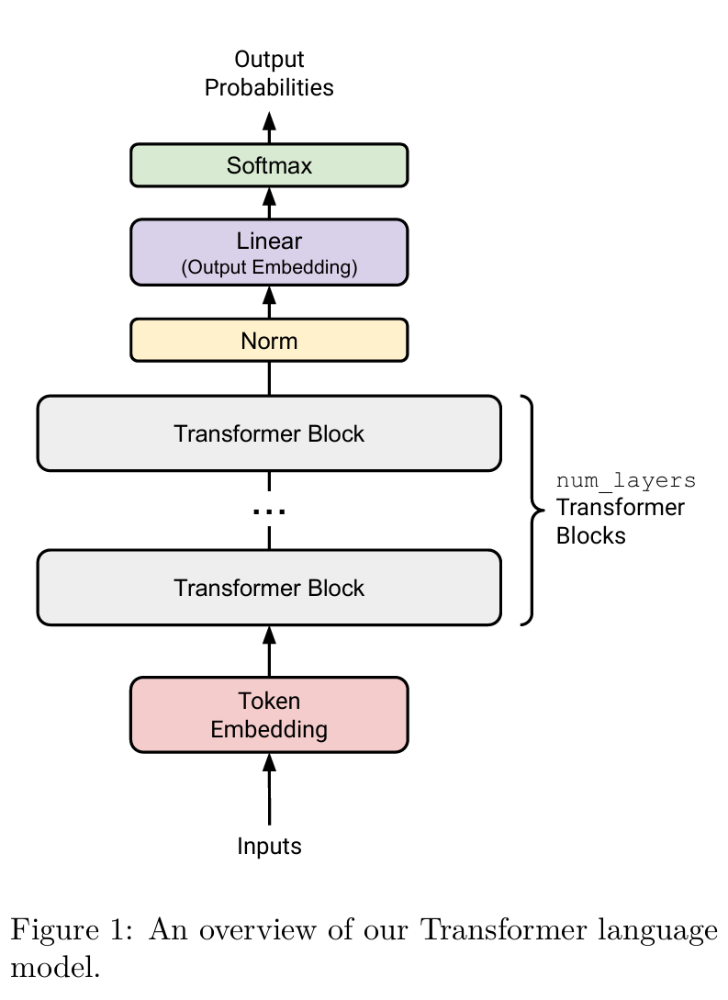
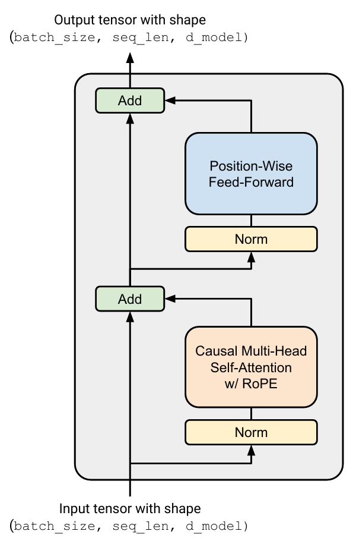

# 12-14
# 2 Byte-Pair Encoding (BPE) tokenizer
## 2.1 The Unicode Standard

和pdf里写的一样 unicode define了15000+的character   
s 是code point 115
```python
>>> z = ord('s')
115

>>> chr(115)
's'
```
此处可见ord() : 
  convert 一个 single Unicode character 一个unicode的字符
  变成 its integer representation 他的整数表示 
  这个integer 指的就是 Unicode code point
chr():
  把一个 整数表达
  (这个整数必须是一个 valid Unicode code point) 
  转换成对应的 single Unicode character
  (返回值在 Python 里是一个 长度为 1 的字符串)

print(chr(0))
- 输出的是 字符本身
- 该字符是 NULL（不可打印）
- 所以终端 看起来什么都没有

repr(chr(0))
- 输出的是 escaped representation
- 使用的是 十六进制形式 \x00
- 这是为了 让人类和调试器可读

NULL本身连打印 都不占位置
```python
>>> print("this is a test" + chr(0) + "string")
this is a teststring
```
## 2.2 Unicode Encodings

因为直接用unicode不现实
150k 的item 很多都用不到
很多字符及其罕见
vocab 会很稀疏

我们直接用unicode encoding UTF-8
因为
不用细看 但是大概是这样做的 


[[../../理解/utf-8.md]]
UTF-8 的目的不是压缩字符数量，而是把任意 Unicode 字符映射成由有限的 byte（0–255）组成的序列，从而用可变长度编码表示所有字符，并保证向后和向前兼容。


### Problem(unicode2):


(b)
The function incorrectly decodes each byte separately, but UTF-8 characters may span multiple bytes, causing multi-byte characters such as "こ" to be decoded incorrectly.

## 2.4 BPE Tokenizer Training
(总结版 现在不解释)
raw text 
 → special token handling
 → pre-tokenizer (regex)
 → UTF-8 bytes
 → BPE merges
 → token IDs

### Pre-tokenization 

Pre-tokenizer 的作用不是“决定最终 token”，而是把文本切成“合理的小块”，让 BPE 在这些块内部统计和 merge。
```python
>>> # requires `regex` package
>>> import regex as re
>>> PAT = r"""'(?:[sdmt]|ll|ve|re)| ?\p{L}+| ?\p{N}+| ?[^\s\p{L}\p{N}]+|\s+(?!\S)|\s+"""
>>> re.findall(PAT, "some text that i'll pre-tokenize")
['some', ' text', ' that', ' i', "'ll", ' pre', '-', 'tokenize']
```
可以看出 pre-rtokenization是先将句子变成一个个词和符号和


踩的坑 正则表达式 regex 写了分段
只能一行
具体看 ./理解/pre-tokenizer-regex

### 使用re.finditer 而不是 re.findall
```python
>>> re.findall(PAT, "some text that i'll pre-tokenize")
>>>['some', ' text', ' that', ' i', "'ll", ' pre', '-', 'tokenize']

for m in re.finditer(PAT2, english_words, flags=re.VERBOSE):
    print(m.group(0))

The original sentence using PAT2 'some text that i'll pre-tokenize'
some
 text
 that
 i
\'ll
 pre
-
tokenize
```
#### re.findall
可见 re.finall(pattern,text)
会生成一个list

#### re.finditer
但是re.finditer(pattern,text,flag = re.VERBOSE) 是一个scanner
得用 for m in 上述这个
然后每个scan的 都得用 m.group(0)

#### 创建字典
```python
counts = {}
```
直接生成字典
如果使用直接按照whitespace分的话
是text_list = text.split(" ")
注意空格 以及返回的是list

### 2.4A python 里怎么创建和查看`bytes`
1. 首先b是一个bytes 对象 
  b = b'low'
  bytes 是 Python 的一个内建类型

2. 其次 bytes是一个 不可变的字节序列 
  每个元素是一个 0~255 的 int（8-bit）
  
  因为是字节序列（sequence）
  所以可以遍历
  遍历时返回的也是 int
```python
list（b）
#[108,111,119]  每个 int 是该字节的“数值” ✔ 取值范围刚好是 0~255
    # 每个元素是一个 8-bit 的字节
    # Python 用 0~255 的 int 来表示这个字节的值
```

3. bytes(int值) 是创建一个 长度为 n 的 bytes 对象
    每个字节都是 0（\x00）

4. 但是如果是 bytes([n]) 
    创建一个长度为 1 的 bytes 对象
    👉 这个字节的值是 n
    ✔ [n] 是一个 iterable
    ✔ 表示“我要一个值为 n 的字节”

5.索引返回 int 切片返回 bytes


##### 1 `b"..."` literal
```python
b"abc"          # 只能直接写 ASCII 字符
b"\xe4\xb8\xad" # 可以用十六进制转义写任意字节
```

##### 2 `str.encode(...)`：从文本到字节
```python
s = "中文"
bs = s.encode("utf-8")
# bs 是 bytes
```
 
##### 3 `bytes.decode(...)` 从字节到文本
```python
bs = b"\xe4\xb8\xad\xe6\x96\x87"
s = bs.decode("utf-8")
```


##### 4 `bytes([x,y,z])` 用整数列表构造
```python
bytes([65, 66, 67])  # b'ABC'
```

##### 5 bytes 的“元素”是什么
```python
b = b"ABC"
b[0]      # 65（int）
b[0:2]    # b'AB'（bytes）
list(b)   # [65, 66, 67]
```


#### 2.4B 读取文件
https://chatgpt.com/g/g-p-693f75d2365c8191baf9aaa7038e3595-cs336xiao-xi-jie/c/6948a752-5e40-832e-bb7f-f6299b8b04be
##### 1. open() 与上下文管理器 with

一定优先用 with open(...) as f:：自动关闭文件、异常也能正确释放资源。
不用 with 就要手动 f.close()，很容易忘。

```python
from pathlib import Path
path = Path("data.txt")
with path.open("r", encoding="utf-8") as f:
    text = f.read()
```

1️⃣ 你要解决的实际问题是什么？

在 BPE 训练前，要求：
special tokens（如 <|endoftext|>）不能参与 pre-tokenization

不能跨 special token 做 merge
所以流程是：

先按 special tokens 切文本 → 每一段单独做 regex pre-tokenization

1. 不用正则（对比用）
  ```python
    text = "A<X>B<X>C"
    print(text.split("<X>"))
  ```

2.  必须「连接两个可匹配的东西」

    正则里的基本形式是：
    A | B
    意思是：
    匹配 A 或 B
    所以你必须给它左操作数和右操作数：
    <X> | <Y>

3. join 做的事（非常精确）
    "|".join(["<X>", "<Y>", "<Z>"])
    结果：
    "<X>|<Y>|<Z>"
    join 需要一个可迭代对象 所以generator expression和 list comprehension都行
```python
"|".join(re.escape(tok) for tok in special_tokens)
"|".join([re.escape(tok) for tok in special_tokens])
```
```python
(re.escape(tok) for tok in special_tokens)
```
它产生的是：
一个 惰性 iterable
每次 join 需要下一个元素时才计算

4. re.escape
    是把特殊的符号 例如 
    special token 通常长这样：
    <|endoftext|>
    但在正则里：
    |
    <
    >
    都有特殊含义
    👉 如果你直接用，会被 regex 误解
    ❌ 错误示例
    ```python
    pattern = "|".join(["<|endoftext|>"])
    ```

### 2.4C sum
`sum(iterable, start=0) `
等价于：

```python
total = start
for x in iterable:
    total = total + x
return total
```

1) 求数字和（最常见）

```python
nums = [1, 2, 3]
total = sum(nums)          # 6
total2 = sum(nums, 10)     # 16  (从 10 开始加)
```

2) 对生成器求和（省内存）
```python
total = sum(i*i for i in range(10))
```

3) 合并“支持 + 的对象”，用 start 指定初始值
```python
from collections import Counter
counters = [Counter("ab"), Counter("bc")]
merged = sum(counters, Counter())
```

#####

### 2.4D Counter 
1) 直接统计频次
```python
from collections import Counter
cnt = Counter("banana")
# Counter({'a': 3, 'n': 2, 'b': 1})
```

2) 逐步累加（最常用）

```python
cnt = Counter()
for tok in tokens:
    cnt[tok] += 1
```

3) 批量更新
```python
cnt.update(tokens)              # tokens 是 iterable
cnt.update({"a": 2, "b": 1})    # 也可以是 mapping
```

4) top-k 高频
```python
cnt.most_common(5)
```

5) 合并/加减（计数语义）
```python
c1 = Counter(a=2, b=1)
c2 = Counter(a=1, b=5, c=1)

c1 + c2   # 计数相加
c1 - c2   # 计数相减（会过滤 <=0）
c1 & c2   # 每个键取 min
c1 | c2   # 每个键取 max
```
6) 不存在的键默认是 0
```python
cnt = Counter()
cnt["missing"]    # 0
```

### 2.5E Counter vs dict：常见用法对比（你写作业最常碰到）
A) 计数（token -> 次数）

✅ 用 Counter

```python
cnt = Counter()
cnt[tok] += 1
```

用 dict 也能做，但更啰嗦：
```python
d = {}
d[tok] = d.get(tok, 0) + 1
```
B) 映射/索引（token -> id, id -> token）

✅ 用 dict（即使 value 是数字也一样）

```python
token2id = {"<pad>": 0, "<unk>": 1}
id2token = {v: k for k, v in token2id.items()}
```

C) 合并多个统计结果

✅ Counter.update / +=（推荐）

```python
total = Counter()
for c in sub_counters:
    total.update(c)     # 或 total += c
```

也可以用 sum(sub_counters, Counter())（能用但通常慢点）

D) “不存在”要不要算 0

要当 0：Counter 更自然

要严格区分不存在 vs 值为 0：dict 更明确


### 2.4E 并行 multiprocessing

#### map + sum  

```python
with Pool(num_processes) as pool:
sub_counters = pool.map(parallel_worker, worker_parameters)
```

两个组成元素
一个是worker function
    拿到的是y 作为iterable中的一份作为参数
    

一个是并行的caller
    pool.map()
      会把pool.map(x,y)
      y中每一个元素 
      作为实参传给x 
      即task（piece of y）
      
```python
def task1(x:str)->list[str]:
    # print(x) # 拿到的是 string
    token_list = x.split(" ")
    # print(token_list) # 返回的是list
    return token_list


if __name__ == "__main__":

    with Pool(4) as pool:
        results = pool.map(task1, list_text)# 这个results是一个list

    bytes_counts = sum(sub_counters, Counter()) # 这里可见 sum 把返回的这个iterable 给一次性扫描归并
```
##### 在做什么
map 会 等所有 worker 都完成
所有 Counter 一次性返回成一个 list
最后用 sum 把它们合并

##### 优点
✅ 代码极简
很“函数式”，一眼就懂
✅ 合并逻辑少
sum 内部是线性 merge，次数 = len(sub_counters)

##### 致命缺点（在 BPE 里非常明显）
❌内存峰值爆炸
    同时存在：
    所有 worker 的 Counter
    最终合并用的 Counter
    在 TinyStories / OWT 上：
    ❗ 这是最容易 OOM / swap / 卡死 的写法

❌ 没有流式反馈
    tqdm 只能包 map，但结果没回来之前你啥也干不了
    看起来像“卡住了”

#### imap_unordered + 增量累加（流式）
from multiprocessing import Pool

```python

bytes_counts = Counter()
with Pool(num_processes) as pool:
    for sub in pool.imap_unordered(
        parallel_worker,
        worker_parameters,
        chunksize=1,
    ):
        bytes_counts += sub
'''
chunk 很重 → chunksize 小
chunk 很轻 → chunksize 大
'''

```
##### 在做什么
parallel_worker 一个任务 → 一个 Counter
worker 算完就立刻返回
主进程 边收到、边累加 到 bytes_counts
顺序 不保证（unordered）

##### 优点
✅ 内存占用低（关键）
    主进程里永远只多一个 sub Counter
    非常适合 TinyStories / OWT 这种 Counter 极大 的场景
✅ 延迟低
    第一个 worker 一算完你就开始累加
    tqdm 能实时动，方便判断“是不是卡死了”
✅ 更稳
    如果某个 chunk 特别大，不会一次性把所有结果堆在内存里

##### 缺点
❌ Python 层 += 次数多
    每个 sub 都要做一次 Counter merge
    如果 worker 数量 × chunk 数量特别大，会有一些 Python 开销


### Compute BPE merges 计算BPE merges

BPE 算法 
1. iteratively 数每一对bytes 并且 识别最高的一对
2. 统计出现最多的一对 
3. 合并 从 'a' 'b' 变成ab
4. 把合并的加入vocabulary 
5. 最后的vocabulary会是256个 初始的 加上 bpe在训练中融合的
6. 不考虑跨pre-token的边界 
7. 如果出现tie的情况 使用lexicographically larger
 （什么是lexicographically larger 待补完 ）
```python
max([(b'l', b'o'), (b'o', b'w')]) == (b'o', b'w')
```

#### 使用tqdm
##### 1️⃣ 包裹任何可迭代对象

```python
from tqdm import tqdm
for x in tqdm(data):
    ...
```

👉 原则：凡是“人会等”的循环，就该有 tqdm
    （tokenize / merge / train / scan file / pool.imap）

##### 2️⃣ 明确 total（非常重要）
```python
for sub in tqdm(pool.imap_unordered(fn, items), total=len(items)):
```

如果没有 total：
    ETA 不准
    百分比不显示
    看起来像“卡住了”（你遇到过）

##### 3️⃣ 给 tqdm 起一个“解释型名字”

```python
tqdm(..., desc="Pretokenize chunks")
tqdm(..., desc="BPE merges", unit="merge")
tqdm(..., desc="Counting byte pairs")
```

❌ 不要：
    100%|██████████| 1024/1024

✅ 要：
    Pretokenize chunks:  35%|███▌ | 350/1000
    desc = 你在 debug 时的“心理安全感”

4️⃣ unit 是 underrated 的神器
```python
tqdm(..., unit="chunk")
tqdm(..., unit="merge")
tqdm(..., unit="MB")
```

比如 BPE merge：
```python
for _ in trange(num_merges, desc="BPE merges", unit="merge"):
```
会显示：
    BPE merges:  1234/10000 merge


##### 4️⃣ unit 是 underrated 的神器
tqdm(..., unit="chunk")
tqdm(..., unit="merge")
tqdm(..., unit="MB")


比如 BPE merge：

for _ in trange(num_merges, desc="BPE merges", unit="merge"):
    ...


会显示：

BPE merges:  1234/10000 merge

##### 5️⃣ imap / imap_unordered + tqdm（你正在用的）

```python
with Pool(num_processes) as pool:
    for sub in tqdm(
        pool.imap_unordered(worker, params, chunksize=1),
        total=len(params),
        desc="Pretokenize chunks",
    ):
        bytes_counts += sub
```


✅ 这是多进程 + tqdm 的最优解之一
    为什么不用 map？
    map 会 等所有 worker 完成才返回
    tqdm 完全没法更新

#### Map reduce

✔️ 理论上内存够
✔️ 但因为反复产生峰值
✔️ Linux 触发 swap
✔️ swap 的是“还在用的 Python 对象”
✔️ 导致 page fault + swap 循环
✔️ 程序看似没死，实则被 IO 吞掉
##### Map 部分的小细节

1. 创建tmp_dir
##### 一、pathlib.Path：不是“更好看”，而是更少 bug
1️⃣ 为什么不用 str + os.path 了？
    传统写法的问题你肯定已经踩过：
```python
path = "/tmp" + "/" + "part_0001.pkl"   # 容易错
path = os.path.join("/tmp", "part_0001.pkl")  # 可读性差
```


Path 的核心价值不是简洁，是:  

👉 把“路径”当成一个对象，而不是字符串

2️⃣ Path 的三个最常用动作（90% 场景:  
✅ 创建 / 表示路径（不访问磁盘）
```python
from pathlib import Path
p = Path("/tmp/bpe")
```

⚠️ 注意： 
这一步不会创建目录  
只是一个“路径描述对象”  

✅ 路径拼接（最重要）
```python
p = Path("/tmp/bpe")
file = p / "part_0001.pkl"
```
你现在用的正是这个：  
path = tmp_dir / f"part_{i:04d}.pkl"


这一步的隐含好处：

1. 自动处理 /
2. Windows / Linux 通用
3. 不会出现 // 或漏 /

✅ 与老 API 交互
```python
with open(path, "wb") as f:
open()
pickle.dump()
torch.save()
```
👉 都天然支持 Path

这是 Path 能在工程里真正“落地”的原因。

3️⃣ Path 在你这段代码里的真实价值
```python
tmp_dir = Path(tempfile.mkdtemp(...))
path = tmp_dir / f"part_{i:04d}.pkl"
```
你在做的是： 
把 MapReduce 的中间文件，当成“结构化路径空间”来管理  
而不是： 
到处拼字符串   
搞不清哪些是目录，哪些是文件  
这是 infra 风格，不是脚本风格。  

##### 二、tempfile.mkdtemp：你在向操作系统“租一块安全空间”
1️⃣ mkdtemp 到底干了什么？  
```python
tmp = tempfile.mkdtemp() 
```
操作系统层面语义是：
“帮我创建一个 唯一、不冲突、已存在 的临时目录，并把路径给我”  
它保证了三件事： 
1. 目录一定存在
2. 名字不会撞
3. 创建过程是原子的（线程/进程安全）

2️⃣ 为什么不用 mkdir("/tmp/xxx")？
因为这段代码在并行 / 多进程环境里：  
```python
os.makedirs("/tmp/bpe_mapreduce")
```
可能会：
1. 被另一个进程抢先创建
2. 抛异常
3. 或 silently 覆盖  

而 mkdtemp 的语义是：  
👉 这个目录只属于你这一次运行  

3️⃣ mkdtemp vs TemporaryDirectory（非常重要）  
API	会自动删除吗	适合谁  
mkdtemp()	❌ 不会	MapReduce / pipeline  
TemporaryDirectory()	✅ with 结束自动删	小脚本 / unit test  

你现在用 mkdtemp 是对的，因为：

1. reduce 可能很久  
2. 可能要 checkpoint / debug  
3. 中途崩溃你还想 ls 看文件  

4️⃣ 在你这个 MapReduce 里的真实意义
```python
tmp_dir = Path(tempfile.mkdtemp(prefix="bpe_mapreduce_"))
```  
你其实是在说：  
“我现在要开始一个 独立的 MapReduce job，  
给我一个 干净的 scratch space。”   
这是 分布式系统思维，不是 Python 语法糖。   

##### 三、prefix：不是装饰，是“调试与运维接口”  
1️⃣ prefix 的作用非常朴素  
```python
tempfile.mkdtemp(prefix="bpe_mapreduce_")  
```
最终路径大概是：  
```bash 
/tmp/bpe_mapreduce_8qk4v9n2  
```
prefix 做了什么？  
1. 给随机目录名加一个人类可读标签  
2. 剩下部分保证唯一性  

2️⃣ 为什么 prefix 在 infra 代码里非常重要？

设想你在服务器上：
```bash
ls /tmp
```
看到：
```bash
tmpa9f3
tmpz71k
bpe_mapreduce_8qk4v9n2
torch_compile_xxx
```

你一眼就知道：
1.哪个是你的 job
2. 哪个可以删
3. 哪个不敢动
👉 这就是 运维可观测性

3️⃣ prefix 的“隐藏好处”   
✅ 崩溃后可追溯
程序挂了  
你还能 cd /tmp/bpe_mapreduce_*
看： part_*.pkl
1. 哪个 chunk 最慢
2. 文件大小分布

✅ 多 job 并行不混  
同时跑 TinyStories + OWT  
prefix 不同即可区分  

##### 四、enumerate 干的事情
enumerate 干的事情（非常重要）
```python
for i, sub in enumerate(iterator):
```
enumerate 做的不是“恢复原 index”，而是：  
在消费 iterator 的那一刻，按“到达顺序”分配一个新 id


### Problem(train_bpe_tinystories):BPETrainingonTinyStories (2points)

#### a  How many hours and memory did training take?What is the longest token in the vocabulary? Does it make sense?
1. Serialize the resulting vocabulary and merges to disk 
    for further inspection

1. 需要创建存放的文件夹

```python
#存放的目录 是项目文件夹中的
OUT_DIR = "/home/dexterding/projects/assignment1-basics/bpe_outputs"
os.makedirs(OUT_DIR, exist_ok=True)

VOCAB_PATH = os.path.join(OUT_DIR, "tinystories_vocab.pkl")
MERGES_PATH = os.path.join(OUT_DIR, "tinystories_merges.pkl")
PROFILE_PATH = os.path.join(OUT_DIR, "profile.txt")
```

2. 将返回的vocab和merges 用pickle.dump(XXXX,f) 的方式存放
```python
    # =========================
    # SAVE ARTIFACTS
    # =========================
    with open(VOCAB_PATH, "wb") as f:
        pickle.dump(vocab, f)

    with open(MERGES_PATH, "wb") as f:
        pickle.dump(merges, f)
```


3. 如何测试 所用的时间

在训练的开头和结尾分别放一个 
```python
start_time = time.time()
## training code
end_time = time.time()
    print(f"Training time (this run): {(end_time - start_time)/60:.2f} minutes")

```

4. 测试vocab和 merge 就用 len(vocab/merges)

5. longest token 
因为 vocab的结构就是 dict[int,bytes]
5.1 可以在跑训练的代码里放这个 
```python 
    longest_token = max(vocab.values(), key=len)
```
5.2 也可以直接读取pickele文件
```python
with open(VOCAB_PATH, "rb") as f:
    vocab = pickle.load(f)
tok_id, tok_bytes = max(vocab.items(), key=lambda kv: len(kv[1]))
print("longest_token_id:", tok_id)
print("byte_len:", len(tok_bytes))
print("raw_bytes_repr:", repr(tok_bytes))
print("decoded_utf8 (replace):", tok_bytes.decode("utf-8", errors="replace"))
```


#### b Profile your code. What part of the tokenizer training process takes the most time
```bash        
1           1262.415    1262.415 1766.558   1766.558 /home/dexterding/projects/assignment1-basics/cs336_basics/debug/parallel_train_bpe_cache.py:171(train_bpe)
5094536393  231.086     0.000    231.086    0.000 {built-in method builtins.len}
2255121258  121.755     0.000    121.755    0.000 {method 'append' of 'list' objects}
28286       51.462      0.002    80.908     0.003 {built-in method builtins.max}
9743        0.033       0.000    80.902     0.008 /home/dexterding/projects/assignment1-basics/cs336_basics/debug/parallel_train_bpe_cache.py:127(get_highest_pair)```

可见大多数时间是 len（）和 list.append 占据大多数时间 因为一直在大规模构建

Training time (this run): 7.15 minutes
Peak RSS (main + children): 7.47 GB
Main RSS delta (end-start): 0.06 GB
Vocab size: 10000 | merges: 9743
Longest token bytes: 13
```

## 2.6 BPE Tokenizer: Encoding and Decoding

### 2.6.1 Encoding text
#### 小细节
1.注意此处的@classmethod 和 后续的return cls 本质上是 返回一个class instance

#### 思路理解 
##### Step1: Pre-tokenize.
We first pre-tokenize the sequence and represent each pre-token as a sequence of UTF-8 bytes, just as we did in BPE training.

首先还是要把text 变成sequence of bytes 
问题是流程是否还一样
1. 首先split special token
因为有可能出现 "You are cat<|speical|>" 
因为special token和其他词语连一块 不希望tokenizer把 cat<|speical|>连在一起
所以就要先split后再用PAT分词
然后再逐个encode(utf-8)

We will be merging these bytes within each pre-token into
vocabulary elements, handling each pre-token independently(nomergesacrosspre-tokenboundaries).

##### Step2:Apply the merges.
We then take the sequence of vocabulary element merges created during BPE
training, and apply it to our pre-tokens in the same order of creation.


 防御性编程 encode完成 
 逻辑是greedy加改循环变量 
 通过更改tokens 
 来更新循环变量条件 
 用字典生成式反转


 # 3 Transformer Language Model Architecture

语言模型的
输入是一批（batched）整数形式的 token ID 序列  
（即形状为 `(batch_size, sequence_length)` 的 torch.Tensor），

输出是一批在词表上的归一化概率分布  
（即形状为 `(batch_size, sequence_length, vocab_size)` 的 PyTorch Tensor），

其中每一个位置上的概率分布，都是在预测“下一个 token”。

`在训练语言模型时`   
我们使用这些“下一个词”的预测predictions结果，  
来计算真实下一个词与模型预测分布之间的交叉熵损失 cross-entropy loss。

`在推理（生成文本）时`  
我们只取序列最后一个位置的“下一个词概率分布”，  
用它来生成下一个 token  
（例如：取最大概率的 token，或从分布中采样），  
然后把生成的 token 追加到输入序列末尾，  
并不断重复这个过程。  

## 3.1 Transformer 语言模型 

给定一段 token ID 序列，
Transformer 语言模型会：

1. 使用输入 embedding把 token ID 转成稠密向量  

2. 将这些向量送入 num_layers 个 Transformer block

3. 再通过一个学习得到的线性投影  
（也叫 output embedding 或 LM head）  
来产生预测下一个 token 的 logits  


### 3.1.1 Token Embeddings（词元嵌入）
在最开始的一步中，Transformer 会把（按 batch 组织的）token ID 序列嵌入成一串向量，  
这些向量包含了 token 身份的信息（见图 1 中的红色方块）。   

更具体地说，给定一个 token ID 的序列，Transformer 语言模型使用一个 token embedding 层 来生成一组向量。  
这个 embedding 层接收一个形状为  
(batch_size, sequence_length) 的整数张量作为输入，
并输出一个形状为  
(batch_size, sequence_length, d_model) 的向量张量。  

#### 理解  
Embedding ≠ Linear  
本质是：  
embedding_matrix[token_id]  
而不是 x @ W  
所以在实现中你只能用索引，不是矩阵乘法  

### 3.1.2 Pre-norm Transformer Block
在完成 embedding 之后，激活值会被送入多个结构完全相同的神经网络层中处理。  
一个标准的 decoder-only Transformer 语言模型 由 num_layers 个完全相同的层组成（通常称为 Transformer “blocks”）。

每个 block 会：
通过 自注意力（self-attention） 在序列维度上聚合信息
通过 前馈网络（feed-forward layers） 对信息进行非线性变换



1. “identically structured” 是关键  
所有 block：
结构一样  
参数不同  
  类似 CNN 里“重复堆叠卷积层”

2. decoder-only  
- 只有 self-attention  
- 没有 encoder / cross-attention
- 配合 causal mask

3. 为什么输入输出形状必须一样
- 因为有 residual：
```python
x + f(x)
```

4. 总结这个 block
- “先看全局（attention），再做逐位置的非线性变换（FFN）”

## 3.2 Output Normalization and Embedding

输出归一化与输出嵌入

在经过 num_layers 个 Transformer block 之后，我们会取最终的激活值，并将其转换为一个对整个词表的概率分布。  

我们将实现 pre-norm Transformer block（详见 §3.5）。  
这种结构还要求在最后一个 Transformer block 之后，  
再额外使用一次 layer normalization，以确保输出的尺度是合适的。  

在完成归一化之后，我们会使用一个标准的、可学习的线性变换，  
将 Transformer block 的输出转换为预测下一个 token 的 logits  
（例如见 Radford et al. [2018] 的公式 2）。


## 3.3 Remark: Batching, Einsum and Efficient Computation

在整个 Transformer 中，我们会反复对许多“类似 batch 的输入”执行相同的计算。举例如下：

1. Batch 的元素：对 batch 中的每个element 应用相同的 Transformer 前向计算

2. 序列长度维度：像 RMSNorm 和前馈网络这样的“逐位置（position-wise）”操作，对序列中每个位置做相同的处理

3. 注意力头（attention heads）：多头注意力中的 attention 操作，本质上是在 head 维度上做 batch


```python
channels_last = torch.randn(64, 32, 32, 3) # (batch, height, width, channel)
B = torch.randn(32*32, 32*32)
## Rearrange an image tensor for mixing across all pixels
channels_last_flat = channels_last.view(-1, channels_last.size(1) * channels_last.size(2), channels_last.size(3)
)
'''
此处 注意是 channels_last.size(1) * channels_last.size(2)
'''
channels_first_flat = channels_last_flat.transpose(1, 2)
channels_first_flat_transformed = channels_first_flat @ B.T
channels_last_flat_transformed = channels_first_flat_transformed.transpose(1, 2)
channels_last_transformed = channels_last_flat_transformed.view(*channels_last.shape)
'''
此处 注意是 使用的拆包 直接拆出来B H W C 
'''
Instead, using einops:
height = width = 32
## Rearrange replaces clunky torch view + transpose
channels_first = rearrange(
channels_last,
"batch height width channel-> batch channel (height width)"
)
channels_first_transformed = einsum(
channels_first, B,
"batch channel pixel_in, pixel_out pixel_in-> batch channel pixel_out"
)
channels_last_transformed = rearrange(
channels_first_transformed,
"batch channel (height width)-> batch height width channel",
height=height, width=width
)
```
### 3.3.1 数学记号与内存顺序（Mathematical Notation and Memory Ordering）
许多机器学习论文在数学记号中使用行向量（row vectors），这种表示方式与 NumPy 和 PyTorch 默认使用的行主序（row-major）内存布局非常契合。

在使用行向量的情况下，一个线性变换可以写成：
$$ 
 y = x W^{T}
$$

其中：
$$ 
𝑊∈𝑅^{𝑑_{out}×𝑑_{in}} 
$$
$$
x∈𝑅^{1×d_{m}}
$$	​

---
而在线性代数中，更常见的是使用列向量（column vectors）。此时，线性变换写成：
$$ 
y = Wx
$$ 
$$ 
𝑊∈𝑅^{𝑑_{out}×𝑑_{in}} 
$$
$$
x∈𝑅^{d_{in}}
$$	
 是一个列向量 column vector
 在数学推导中统一使用列向量记号，因为这种方式在数学上更容易理解。

但需要注意的是：
👉 如果你在代码中直接使用矩阵乘法（如 @），就必须遵循 行向量约定，因为 PyTorch 使用的是行主序内存布局。

如果你使用 einsum 来做矩阵运算，那么这个问题基本可以忽略。
## 3.4 基本模块：Linear 与 Embedding
### 3.4.1 参数初始化
有效训练神经网络通常需要精心设计的参数初始化。糟糕的初始化会导致梯度消失或爆炸。  
虽然 Pre-norm Transformer 对初始化相对鲁棒，但初始化方式仍会显著影响训练速度和收敛性。   
在本次作业中，我们使用以下近似初始化方案：  
其他的留到assignment3 里

#### Linear 权重初始化
$$
W \sim \mathcal{N}
\left(
0,\;
\frac{2}{d_{\text{in}} + d_{\text{out}}}
\right),
\quad W \in [-3\sigma, 3\sigma]
$$

① 正态分布（Gaussian / Normal）

$$
\mathcal N(\mu, \sigma^2)
$$

- 均值：
$$\mu = 0\$$
- 方差：
$$\sigma^2 = \frac{2}{d_{\text{in}} + d_{\text{out}}}\$$

这是一种 **Xavier / Glorot 初始化的变体**。

---

#### ② 为什么方差是 
$sigma^2 = \frac{2}{d_{\text{in}} + d_{\text{out}}}$

- $d_{\text{in}}$：输入维度  
- $d_{\text{out}}$：输出维度  

直觉理解：

- 每一层的输出是很多权重 × 输入的**累加**
- 如果权重太大 → 激活值 / 梯度爆炸
- 如果权重太小 → 激活值 / 梯度消失
- 这个方差让前向和反向传播的尺度保持稳定

一句话总结：

> **层越宽，每个权重就应该越小**

---

#### ③ truncated at $[-3\sigma, 3\sigma]$ 是什么意思？

这是 **截断正态分布（Truncated Normal）**：

- 先按正态分布采样
- 如果值超出 \([-3\sigma, 3\sigma]\)，就丢弃并重新采样

原因：

- 高斯分布是无界的，极小概率会采到特别大的值
- Transformer 对这种 outlier 非常敏感
- ±3σ 覆盖约 **99.7%** 的概率质量
- 几乎不改变分布形状，但显著提高稳定性

---


### Embedding 初始化
$$
E \sim \mathcal{N}(0, 1), \quad E \in [-3, 3]
$$
Embedding 的本质是：

- **查表（lookup）**
- 不做矩阵乘法
- 不发生大规模累加

因此：

- 不存在输入维度导致的数值放大问题
- 使用单位方差$\sigma^2 = 1$就足够
- 同样用截断防止极端值
### RMSNorm 初始化

$$
g_i = 1
$$

| 模块        | 初始化方式                               |
| --------- | ----------------------------------- |
| Linear    | `torch.nn.init.trunc_normal_`       |
| Embedding | `torch.nn.init.trunc_normal_`       |
| RMSNorm   | `nn.Parameter(torch.ones(d_model))` |

### 3.4.2 Linear 模块

原文翻译

Linear 层是 Transformer 和神经网络中最基本的构件之一。

你需要实现一个自定义的 Linear 类（继承 torch.nn.Module），完成如下线性变换：

线性变换定义为：
$$
\mathbf{y} = \mathbf{W} \mathbf{x}
$$
其中：
$$
\mathbf{W} \in \mathbb{R}^{d_{\text{out}} \times d_{\text{in}}}
$$
注意：
不包含 bias 项（这是现代大模型的常见做法）。


###作业须知

1. 首先继承class
不只是
```python 
class Linear(nn.Module)
而且不能忘了 
super().__inti__()
```
2. 创建空的torch 不用ones 不用zeros
```python
用
torch.empty(x,y,device=device,dtype=dtype)
```

3. 创建高斯分布

这个trunc_normal的操作时in place的
```python
torch.nn.init.trunc_normal_(
    tensor=W,
    mean=mean,
    std=std,
    a=-3*std,
    b=3*std
)
```

4. pytroch自动记录参数 需要用nn.Parameter
```python
self.W = nn.Parameter(W)
```

5. adapter
```python
embedding.load_state_dict({"weights":weights})
```
前面的weights 是class 中的instance attribute
后面的weights是读取的值

## 3.5 Pre-Norm Transformer Block（预归一化 Transformer 块）

每个 Transformer block 包含两个子层（sub-layer）：
多头自注意力（Multi-Head Self-Attention）  
逐位置前馈网络（Position-wise Feed-Forward Network）  
在最初的 Transformer（Vaswani et al., 2017）中，每个子层的结构是：  

子层 → 残差连接 → LayerNorm

这种结构被称为 Post-Norm Transformer（后归一化），因为 LayerNorm 作用在子层输出上。

后续研究发现，如果将 LayerNorm 从子层输出移动到子层输入，并在最后一个 Transformer block 之后再加一次归一化，可以显著提升训练稳定性（Nguyen & Salazar, 2019；Xiong et al., 2020）。这种结构被称为 Pre-Norm Transformer（预归一化）。

在 Pre-Norm 结构中：

每个子层 先做归一化  
再进入子层计算  
最后通过 残差连接（residual connection） 与输入相加

直观理解是：

从输入 embedding 到最终输出，有一条**“干净的残差流（residual stream）”**，中间没有被归一化打断，这有助于 梯度传播更稳定。  
目前几乎所有主流大语言模型（如 GPT-3、LLaMA、PaLM）都采用 Pre-Norm Transformer，因此本作业也实现这一版本。

Pre-Norm Transformer 的数学形式

设输入为
$$
𝑥∈𝑅^{𝑑_{model}} 
$$
一个 Transformer block 的两层可写为：
（1）自注意力子层
$$
z = x + \mathrm{MHA}(\mathrm{Norm}(x))
$$
（2）前馈网络子层

$$
y = z + \mathrm{FFN}(\mathrm{Norm}(z))
$$
其中：
- Norm 是 RMSNorm（本作业使用）
- MHA 是多头自注意力
- FFN 是逐位置前馈网络
- +是残差连接

原始 Transformer 使用的是 Layer Normalization（LayerNorm）。
本作业中，我们按照 Touvron et al. (2023) 的做法，改用 RMSNorm（Root Mean Square Layer Normalization）。

给定一个激活向量：
$$
\mathbf{a} = (a_1, a_2, \dots, a_{d_{\text{model}}})
\in \mathbb{R}^{d_{\text{model}}}
$$

RMSNorm will rescale each activation ai as follows

$$
\mathrm{RMSNorm}(a_i)
=
\frac{a_i}{\mathrm{RMS}(\mathbf{a})}
\cdot g_i
$$
where RMS(a)
$$
\mathrm{RMS}(\mathbf{a})
=
\sqrt{
\frac{1}{d_{\text{model}}}
\sum_{i=1}^{d_{\text{model}}} a_i^2
+ \varepsilon
}
$$

gi是 可学习的缩放参数（gain） 

一共有 $𝑑_{model}个 𝑔_{i}$

ε 是数值稳定项，通常设为 1le−5

#### 作业实测 linear + embedding + RMSNorm
1. 这里要nn parameter（torch ones/zeros/empty）好像区别都不大  因为都会 
```python
rmsnorm.load_state_dict({"weights":weights})
```

2. 在tensor的计算过程中 记得 sum 或者mean的 dimension
3. math.sqrt 不能处理tensor 的sqrt 
4. keep dimsension 才能broadcast
5. 这里转换type的时候 可以利用 

```python
'''
这里 记得记住in_dtype
然后使用x.to(torch.float32)这种 
'''
in_dtype = x.dtype
x = x.to(torch.float32)
# Your code here performing RMSNorm
...
result = ...
# Return the result in the original dtype
return result.to(in_dtype)
```
6. 如何使用einops 
```python
from einops import einsum
from einops import reduce
```
7. einsum感受 
在标注的同时 完成了 rearrange 并且加上矩阵乘法  
```python
#/home/dexterding/projects/assignment1-basics/cs336_basics/transformer_modules/linear_module.py
forward(self,x:torch.Tensor)->torch.Tensor:
        return x@self.W.T
        
        return einsum(x,self.W,'batch sequence in_f, out_f in_f -> batch sequence out_f')
```
这里是两种 我觉得都写可以双修

8. reduce感受
十分清楚的标注了解了 少掉的 是哪一个dimension以及其含义  
三者等价
```python
x.pow(2).mean(dim=-1,keepdim=True)

x.pow(2).sum(dim=-1,keepdim= True)/self.d_model

mean_square = reduce(x.pow(2), "batch sequence d_model -> batch sequence 1", "mean")
```

### 3.5.2 Position-Wise Feed-Forward Network
原文

在最初的 Transformer 论文（Vaswani 等，2017，第 3.3 节）中，**前馈网络（Feed-Forward Network, FFN）**由两层线性变换组成，中间使用 ReLU 激活函数（ReLU(x) = max(0, x)）。其中，中间隐藏层的维度通常是输入维度的 4 倍。

然而，现代语言模型相较于这一原始设计，通常引入了`两`个主要变化：  
使用不同于 ReLU 的激活函数；

引入一种 门控机制（`gating mechanism`）。
具体来说，我们将实现一种名为 `SwiGLU` 的激活函数，该函数已被诸如 Llama 3 和 Qwen 2.5 等大语言模型采用。

`SwiGLU` 将 `SiLU`（又称 Swish）激活函数 与一种称为 `Gated Linear Unit（GLU）` 的门控结构结合起来。

此外，遵循自 PaLM 与 LLaMA 以来的大多数现代 LLM 的实践，我们在这些线性层中 省略 bias 项。

1️⃣ SiLU / Swish 激活函数

SiLU（或 Swish）激活函数定义如下：
$$
\mathrm{SiLU}(x) = x \cdot \sigma(x) = \frac{x}{1 + e^{-x}}
$$

它与 ReLU 类似，但在 0 附近是 平滑的（smooth），而不是有折点。

2️⃣ Gated Linear Unit（GLU）  

GLU 最早由 Dauphin 等人在 2017 年提出，其定义为：  
一个线性变换经过 sigmoid 后，与另一个线性变换进行逐元素相乘。
$$
\mathrm{GLU}(x, W_1, W_2)
= \sigma(W_1 x) \odot (W_2 x)
$$

GLU 被认为可以：  
通过提供一条“线性梯度通路”，在保留非线性能力的同时，缓解深层网络中的梯度消失问题。

3️⃣ SwiGLU：SiLU + GLU 的组合

将 SiLU（Swish）和 GLU 结合，就得到了 SwiGLU，我们将在 Transformer 的前馈网络中使用它：
$$
\mathrm{FFN}(x)
= \mathrm{SwiGLU}(x, W_1, W_2, W_3)
= W_2 \left( \mathrm{SiLU}(W_1 x) \odot (W_3 x) \right)
$$

一个线性投影W1负责 非线性变换（SiLU）  
另一个线性投影W3负责 门控

两者逐元素相乘后，再经过输出线性层W2

在标准设置中，前馈层的隐藏维度满足：
$$
x \in \mathbb{R}^{d_{\text{model}}}
$$

$$
W_1, W_3 \in \mathbb{R}^{d_{\text{ff}} \times d_{\text{model}}}
$$

$$
W_2 \in \mathbb{R}^{d_{\text{model}} \times d_{\text{ff}}}
$$

$$
d_{\text{ff}} = \frac{8}{3} d_{\text{model}}
$$


4️⃣ 经验视角（Empirical Perspective）

Shazeer（2020）首次系统性地提出将 SiLU/Swish 与 GLU 结合，并通过实验表明：

SwiGLU 在语言建模任务中优于 ReLU

也优于 不带门控的 SiLU

尽管有一些启发式解释，但作者本人保持了非常克制、经验主义的态度，并留下了一句非常著名的话：

我们并不解释为什么这些结构有效；
我们将它们的成功，和其他一切一样，归因于神的仁慈。