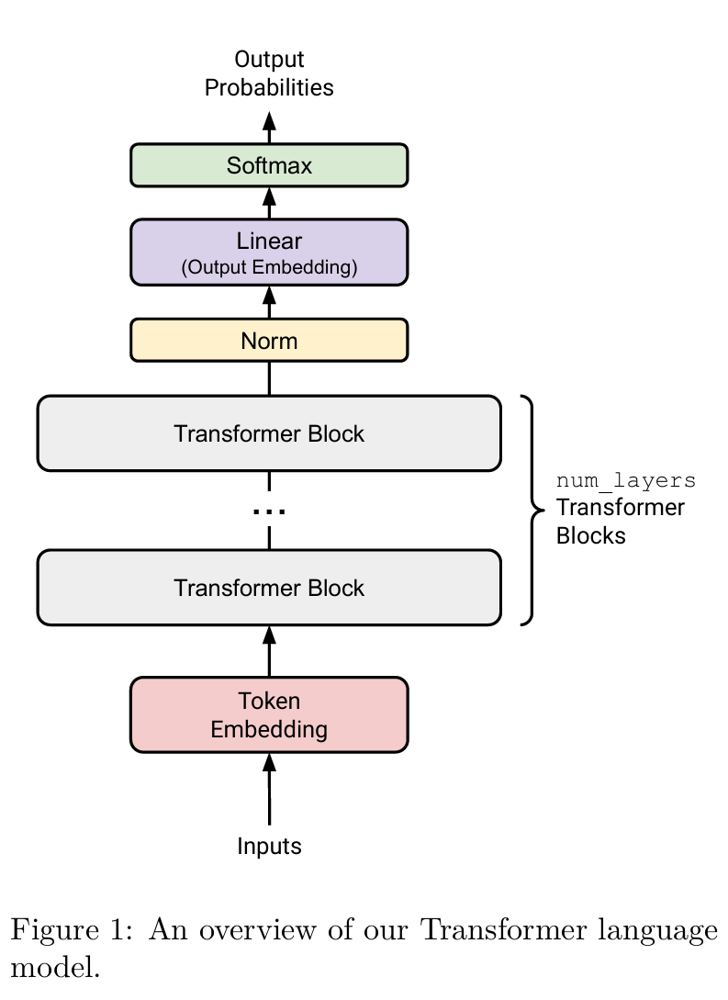
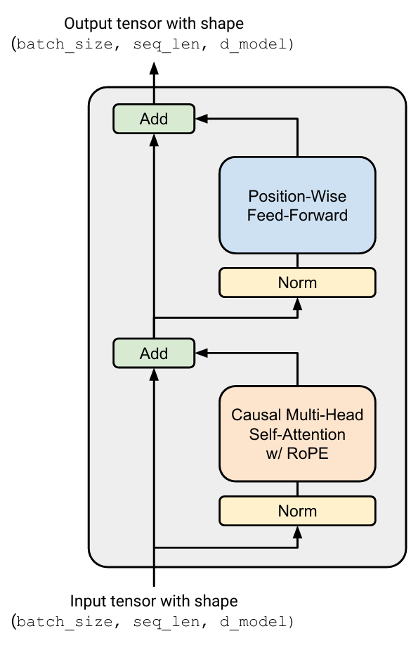

# 12-14
# 2 Byte-Pair Encoding (BPE) tokenizer
## 2.1 The Unicode Standard

和pdf里写的一样 unicode define了15000+的character   
s 是code point 115
```python
>>> z = ord('s')
115

>>> chr(115)
's'
```
此处可见ord() : 
  convert 一个 single Unicode character 一个unicode的字符
  变成 its integer representation 他的整数表示 
  这个integer 指的就是 Unicode code point
chr():
  把一个 整数表达
  (这个整数必须是一个 valid Unicode code point) 
  转换成对应的 single Unicode character
  (返回值在 Python 里是一个 长度为 1 的字符串)

print(chr(0))
- 输出的是 字符本身
- 该字符是 NULL（不可打印）
- 所以终端 看起来什么都没有

repr(chr(0))
- 输出的是 escaped representation
- 使用的是 十六进制形式 \x00
- 这是为了 让人类和调试器可读

NULL本身连打印 都不占位置
```python
>>> print("this is a test" + chr(0) + "string")
this is a teststring
```
## 2.2 Unicode Encodings

因为直接用unicode不现实
150k 的item 很多都用不到
很多字符及其罕见
vocab 会很稀疏

我们直接用unicode encoding UTF-8
因为
不用细看 但是大概是这样做的 


[[../../理解/utf-8.md]]
UTF-8 的目的不是压缩字符数量，而是把任意 Unicode 字符映射成由有限的 byte（0–255）组成的序列，从而用可变长度编码表示所有字符，并保证向后和向前兼容。


### Problem(unicode2):


(b)
The function incorrectly decodes each byte separately, but UTF-8 characters may span multiple bytes, causing multi-byte characters such as "こ" to be decoded incorrectly.

## 2.4 BPE Tokenizer Training
(总结版 现在不解释)
raw text 
 → special token handling
 → pre-tokenizer (regex)
 → UTF-8 bytes
 → BPE merges
 → token IDs

### Pre-tokenization 

Pre-tokenizer 的作用不是“决定最终 token”，而是把文本切成“合理的小块”，让 BPE 在这些块内部统计和 merge。
```python
>>> # requires `regex` package
>>> import regex as re
>>> PAT = r"""'(?:[sdmt]|ll|ve|re)| ?\p{L}+| ?\p{N}+| ?[^\s\p{L}\p{N}]+|\s+(?!\S)|\s+"""
>>> re.findall(PAT, "some text that i'll pre-tokenize")
['some', ' text', ' that', ' i', "'ll", ' pre', '-', 'tokenize']
```
可以看出 pre-rtokenization是先将句子变成一个个词和符号和


踩的坑 正则表达式 regex 写了分段
只能一行
具体看 ./理解/pre-tokenizer-regex

### 使用re.finditer 而不是 re.findall
```python
>>> re.findall(PAT, "some text that i'll pre-tokenize")
>>>['some', ' text', ' that', ' i', "'ll", ' pre', '-', 'tokenize']

for m in re.finditer(PAT2, english_words, flags=re.VERBOSE):
    print(m.group(0))

The original sentence using PAT2 'some text that i'll pre-tokenize'
some
 text
 that
 i
\'ll
 pre
-
tokenize
```
#### re.findall
可见 re.finall(pattern,text)
会生成一个list

#### re.finditer
但是re.finditer(pattern,text,flag = re.VERBOSE) 是一个scanner
得用 for m in 上述这个
然后每个scan的 都得用 m.group(0)

#### 创建字典
```python
counts = {}
```
直接生成字典
如果使用直接按照whitespace分的话
是text_list = text.split(" ")
注意空格 以及返回的是list

### 2.4A python 里怎么创建和查看`bytes`
1. 首先b是一个bytes 对象 
  b = b'low'
  bytes 是 Python 的一个内建类型

2. 其次 bytes是一个 不可变的字节序列 
  每个元素是一个 0~255 的 int（8-bit）
  
  因为是字节序列（sequence）
  所以可以遍历
  遍历时返回的也是 int
```python
list（b）
#[108,111,119]  每个 int 是该字节的“数值” ✔ 取值范围刚好是 0~255
    # 每个元素是一个 8-bit 的字节
    # Python 用 0~255 的 int 来表示这个字节的值
```

3. bytes(int值) 是创建一个 长度为 n 的 bytes 对象
    每个字节都是 0（\x00）

4. 但是如果是 bytes([n]) 
    创建一个长度为 1 的 bytes 对象
    👉 这个字节的值是 n
    ✔ [n] 是一个 iterable
    ✔ 表示“我要一个值为 n 的字节”

5.索引返回 int 切片返回 bytes


##### 1 `b"..."` literal
```python
b"abc"          # 只能直接写 ASCII 字符
b"\xe4\xb8\xad" # 可以用十六进制转义写任意字节
```

##### 2 `str.encode(...)`：从文本到字节
```python
s = "中文"
bs = s.encode("utf-8")
# bs 是 bytes
```
 
##### 3 `bytes.decode(...)` 从字节到文本
```python
bs = b"\xe4\xb8\xad\xe6\x96\x87"
s = bs.decode("utf-8")
```


##### 4 `bytes([x,y,z])` 用整数列表构造
```python
bytes([65, 66, 67])  # b'ABC'
```

##### 5 bytes 的“元素”是什么
```python
b = b"ABC"
b[0]      # 65（int）
b[0:2]    # b'AB'（bytes）
list(b)   # [65, 66, 67]
```


#### 2.4B 读取文件
https://chatgpt.com/g/g-p-693f75d2365c8191baf9aaa7038e3595-cs336xiao-xi-jie/c/6948a752-5e40-832e-bb7f-f6299b8b04be
##### 1. open() 与上下文管理器 with

一定优先用 with open(...) as f:：自动关闭文件、异常也能正确释放资源。
不用 with 就要手动 f.close()，很容易忘。

```python
from pathlib import Path
path = Path("data.txt")
with path.open("r", encoding="utf-8") as f:
    text = f.read()
```

1️⃣ 你要解决的实际问题是什么？

在 BPE 训练前，要求：
special tokens（如 <|endoftext|>）不能参与 pre-tokenization

不能跨 special token 做 merge
所以流程是：

先按 special tokens 切文本 → 每一段单独做 regex pre-tokenization

1. 不用正则（对比用）
  ```python
    text = "A<X>B<X>C"
    print(text.split("<X>"))
  ```

2.  必须「连接两个可匹配的东西」

    正则里的基本形式是：
    A | B
    意思是：
    匹配 A 或 B
    所以你必须给它左操作数和右操作数：
    <X> | <Y>

3. join 做的事（非常精确）
    "|".join(["<X>", "<Y>", "<Z>"])
    结果：
    "<X>|<Y>|<Z>"
    join 需要一个可迭代对象 所以generator expression和 list comprehension都行
```python
"|".join(re.escape(tok) for tok in special_tokens)
"|".join([re.escape(tok) for tok in special_tokens])
```
```python
(re.escape(tok) for tok in special_tokens)
```
它产生的是：
一个 惰性 iterable
每次 join 需要下一个元素时才计算

4. re.escape
    是把特殊的符号 例如 
    special token 通常长这样：
    <|endoftext|>
    但在正则里：
    |
    <
    >
    都有特殊含义
    👉 如果你直接用，会被 regex 误解
    ❌ 错误示例
    ```python
    pattern = "|".join(["<|endoftext|>"])
    ```

### 2.4C sum
`sum(iterable, start=0) `
等价于：

```python
total = start
for x in iterable:
    total = total + x
return total
```

1) 求数字和（最常见）

```python
nums = [1, 2, 3]
total = sum(nums)          # 6
total2 = sum(nums, 10)     # 16  (从 10 开始加)
```

2) 对生成器求和（省内存）
```python
total = sum(i*i for i in range(10))
```

3) 合并“支持 + 的对象”，用 start 指定初始值
```python
from collections import Counter
counters = [Counter("ab"), Counter("bc")]
merged = sum(counters, Counter())
```

#####

### 2.4D Counter 
1) 直接统计频次
```python
from collections import Counter
cnt = Counter("banana")
# Counter({'a': 3, 'n': 2, 'b': 1})
```

2) 逐步累加（最常用）

```python
cnt = Counter()
for tok in tokens:
    cnt[tok] += 1
```

3) 批量更新
```python
cnt.update(tokens)              # tokens 是 iterable
cnt.update({"a": 2, "b": 1})    # 也可以是 mapping
```

4) top-k 高频
```python
cnt.most_common(5)
```

5) 合并/加减（计数语义）
```python
c1 = Counter(a=2, b=1)
c2 = Counter(a=1, b=5, c=1)

c1 + c2   # 计数相加
c1 - c2   # 计数相减（会过滤 <=0）
c1 & c2   # 每个键取 min
c1 | c2   # 每个键取 max
```
6) 不存在的键默认是 0
```python
cnt = Counter()
cnt["missing"]    # 0
```

### 2.5E Counter vs dict：常见用法对比（你写作业最常碰到）
A) 计数（token -> 次数）

✅ 用 Counter

```python
cnt = Counter()
cnt[tok] += 1
```

用 dict 也能做，但更啰嗦：
```python
d = {}
d[tok] = d.get(tok, 0) + 1
```
B) 映射/索引（token -> id, id -> token）

✅ 用 dict（即使 value 是数字也一样）

```python
token2id = {"<pad>": 0, "<unk>": 1}
id2token = {v: k for k, v in token2id.items()}
```

C) 合并多个统计结果

✅ Counter.update / +=（推荐）

```python
total = Counter()
for c in sub_counters:
    total.update(c)     # 或 total += c
```

也可以用 sum(sub_counters, Counter())（能用但通常慢点）

D) “不存在”要不要算 0

要当 0：Counter 更自然

要严格区分不存在 vs 值为 0：dict 更明确


### 2.4E 并行 multiprocessing

#### map + sum  

```python
with Pool(num_processes) as pool:
sub_counters = pool.map(parallel_worker, worker_parameters)
```

两个组成元素
一个是worker function
    拿到的是y 作为iterable中的一份作为参数
    

一个是并行的caller
    pool.map()
      会把pool.map(x,y)
      y中每一个元素 
      作为实参传给x 
      即task（piece of y）
      
```python
def task1(x:str)->list[str]:
    # print(x) # 拿到的是 string
    token_list = x.split(" ")
    # print(token_list) # 返回的是list
    return token_list


if __name__ == "__main__":

    with Pool(4) as pool:
        results = pool.map(task1, list_text)# 这个results是一个list

    bytes_counts = sum(sub_counters, Counter()) # 这里可见 sum 把返回的这个iterable 给一次性扫描归并
```
##### 在做什么
map 会 等所有 worker 都完成
所有 Counter 一次性返回成一个 list
最后用 sum 把它们合并

##### 优点
✅ 代码极简
很“函数式”，一眼就懂
✅ 合并逻辑少
sum 内部是线性 merge，次数 = len(sub_counters)

##### 致命缺点（在 BPE 里非常明显）
❌内存峰值爆炸
    同时存在：
    所有 worker 的 Counter
    最终合并用的 Counter
    在 TinyStories / OWT 上：
    ❗ 这是最容易 OOM / swap / 卡死 的写法

❌ 没有流式反馈
    tqdm 只能包 map，但结果没回来之前你啥也干不了
    看起来像“卡住了”

#### imap_unordered + 增量累加（流式）
from multiprocessing import Pool

```python

bytes_counts = Counter()
with Pool(num_processes) as pool:
    for sub in pool.imap_unordered(
        parallel_worker,
        worker_parameters,
        chunksize=1,
    ):
        bytes_counts += sub
'''
chunk 很重 → chunksize 小
chunk 很轻 → chunksize 大
'''

```
##### 在做什么
parallel_worker 一个任务 → 一个 Counter
worker 算完就立刻返回
主进程 边收到、边累加 到 bytes_counts
顺序 不保证（unordered）

##### 优点
✅ 内存占用低（关键）
    主进程里永远只多一个 sub Counter
    非常适合 TinyStories / OWT 这种 Counter 极大 的场景
✅ 延迟低
    第一个 worker 一算完你就开始累加
    tqdm 能实时动，方便判断“是不是卡死了”
✅ 更稳
    如果某个 chunk 特别大，不会一次性把所有结果堆在内存里

##### 缺点
❌ Python 层 += 次数多
    每个 sub 都要做一次 Counter merge
    如果 worker 数量 × chunk 数量特别大，会有一些 Python 开销


### Compute BPE merges 计算BPE merges

BPE 算法 
1. iteratively 数每一对bytes 并且 识别最高的一对
2. 统计出现最多的一对 
3. 合并 从 'a' 'b' 变成ab
4. 把合并的加入vocabulary 
5. 最后的vocabulary会是256个 初始的 加上 bpe在训练中融合的
6. 不考虑跨pre-token的边界 
7. 如果出现tie的情况 使用lexicographically larger
 （什么是lexicographically larger 待补完 ）
```python
max([(b'l', b'o'), (b'o', b'w')]) == (b'o', b'w')
```

#### 使用tqdm
##### 1️⃣ 包裹任何可迭代对象

```python
from tqdm import tqdm
for x in tqdm(data):
    ...
```

👉 原则：凡是“人会等”的循环，就该有 tqdm
    （tokenize / merge / train / scan file / pool.imap）

##### 2️⃣ 明确 total（非常重要）
```python
for sub in tqdm(pool.imap_unordered(fn, items), total=len(items)):
```

如果没有 total：
    ETA 不准
    百分比不显示
    看起来像“卡住了”（你遇到过）

##### 3️⃣ 给 tqdm 起一个“解释型名字”

```python
tqdm(..., desc="Pretokenize chunks")
tqdm(..., desc="BPE merges", unit="merge")
tqdm(..., desc="Counting byte pairs")
```

❌ 不要：
    100%|██████████| 1024/1024

✅ 要：
    Pretokenize chunks:  35%|███▌ | 350/1000
    desc = 你在 debug 时的“心理安全感”

4️⃣ unit 是 underrated 的神器
```python
tqdm(..., unit="chunk")
tqdm(..., unit="merge")
tqdm(..., unit="MB")
```

比如 BPE merge：
```python
for _ in trange(num_merges, desc="BPE merges", unit="merge"):
```
会显示：
    BPE merges:  1234/10000 merge


##### 4️⃣ unit 是 underrated 的神器
tqdm(..., unit="chunk")
tqdm(..., unit="merge")
tqdm(..., unit="MB")


比如 BPE merge：

for _ in trange(num_merges, desc="BPE merges", unit="merge"):
    ...


会显示：

BPE merges:  1234/10000 merge

##### 5️⃣ imap / imap_unordered + tqdm（你正在用的）

```python
with Pool(num_processes) as pool:
    for sub in tqdm(
        pool.imap_unordered(worker, params, chunksize=1),
        total=len(params),
        desc="Pretokenize chunks",
    ):
        bytes_counts += sub
```


✅ 这是多进程 + tqdm 的最优解之一
    为什么不用 map？
    map 会 等所有 worker 完成才返回
    tqdm 完全没法更新

#### Map reduce

✔️ 理论上内存够
✔️ 但因为反复产生峰值
✔️ Linux 触发 swap
✔️ swap 的是“还在用的 Python 对象”
✔️ 导致 page fault + swap 循环
✔️ 程序看似没死，实则被 IO 吞掉
##### Map 部分的小细节

1. 创建tmp_dir
##### 一、pathlib.Path：不是“更好看”，而是更少 bug
1️⃣ 为什么不用 str + os.path 了？
    传统写法的问题你肯定已经踩过：
```python
path = "/tmp" + "/" + "part_0001.pkl"   # 容易错
path = os.path.join("/tmp", "part_0001.pkl")  # 可读性差
```


Path 的核心价值不是简洁，是:  

👉 把“路径”当成一个对象，而不是字符串

2️⃣ Path 的三个最常用动作（90% 场景:  
✅ 创建 / 表示路径（不访问磁盘）
```python
from pathlib import Path
p = Path("/tmp/bpe")
```

⚠️ 注意： 
这一步不会创建目录  
只是一个“路径描述对象”  

✅ 路径拼接（最重要）
```python
p = Path("/tmp/bpe")
file = p / "part_0001.pkl"
```
你现在用的正是这个：  
path = tmp_dir / f"part_{i:04d}.pkl"


这一步的隐含好处：

1. 自动处理 /
2. Windows / Linux 通用
3. 不会出现 // 或漏 /

✅ 与老 API 交互
```python
with open(path, "wb") as f:
open()
pickle.dump()
torch.save()
```
👉 都天然支持 Path

这是 Path 能在工程里真正“落地”的原因。

3️⃣ Path 在你这段代码里的真实价值
```python
tmp_dir = Path(tempfile.mkdtemp(...))
path = tmp_dir / f"part_{i:04d}.pkl"
```
你在做的是： 
把 MapReduce 的中间文件，当成“结构化路径空间”来管理  
而不是： 
到处拼字符串   
搞不清哪些是目录，哪些是文件  
这是 infra 风格，不是脚本风格。  

##### 二、tempfile.mkdtemp：你在向操作系统“租一块安全空间”
1️⃣ mkdtemp 到底干了什么？  
```python
tmp = tempfile.mkdtemp() 
```
操作系统层面语义是：
“帮我创建一个 唯一、不冲突、已存在 的临时目录，并把路径给我”  
它保证了三件事： 
1. 目录一定存在
2. 名字不会撞
3. 创建过程是原子的（线程/进程安全）

2️⃣ 为什么不用 mkdir("/tmp/xxx")？
因为这段代码在并行 / 多进程环境里：  
```python
os.makedirs("/tmp/bpe_mapreduce")
```
可能会：
1. 被另一个进程抢先创建
2. 抛异常
3. 或 silently 覆盖  

而 mkdtemp 的语义是：  
👉 这个目录只属于你这一次运行  

3️⃣ mkdtemp vs TemporaryDirectory（非常重要）  
API	会自动删除吗	适合谁  
mkdtemp()	❌ 不会	MapReduce / pipeline  
TemporaryDirectory()	✅ with 结束自动删	小脚本 / unit test  

你现在用 mkdtemp 是对的，因为：

1. reduce 可能很久  
2. 可能要 checkpoint / debug  
3. 中途崩溃你还想 ls 看文件  

4️⃣ 在你这个 MapReduce 里的真实意义
```python
tmp_dir = Path(tempfile.mkdtemp(prefix="bpe_mapreduce_"))
```  
你其实是在说：  
“我现在要开始一个 独立的 MapReduce job，  
给我一个 干净的 scratch space。”   
这是 分布式系统思维，不是 Python 语法糖。   

##### 三、prefix：不是装饰，是“调试与运维接口”  
1️⃣ prefix 的作用非常朴素  
```python
tempfile.mkdtemp(prefix="bpe_mapreduce_")  
```
最终路径大概是：  
```bash 
/tmp/bpe_mapreduce_8qk4v9n2  
```
prefix 做了什么？  
1. 给随机目录名加一个人类可读标签  
2. 剩下部分保证唯一性  

2️⃣ 为什么 prefix 在 infra 代码里非常重要？

设想你在服务器上：
```bash
ls /tmp
```
看到：
```bash
tmpa9f3
tmpz71k
bpe_mapreduce_8qk4v9n2
torch_compile_xxx
```

你一眼就知道：
1.哪个是你的 job
2. 哪个可以删
3. 哪个不敢动
👉 这就是 运维可观测性

3️⃣ prefix 的“隐藏好处”   
✅ 崩溃后可追溯
程序挂了  
你还能 cd /tmp/bpe_mapreduce_*
看： part_*.pkl
1. 哪个 chunk 最慢
2. 文件大小分布

✅ 多 job 并行不混  
同时跑 TinyStories + OWT  
prefix 不同即可区分  

##### 四、enumerate 干的事情
enumerate 干的事情（非常重要）
```python
for i, sub in enumerate(iterator):
```
enumerate 做的不是“恢复原 index”，而是：  
在消费 iterator 的那一刻，按“到达顺序”分配一个新 id


### Problem(train_bpe_tinystories):BPETrainingonTinyStories (2points)

#### a  How many hours and memory did training take?What is the longest token in the vocabulary? Does it make sense?
1. Serialize the resulting vocabulary and merges to disk 
    for further inspection

1. 需要创建存放的文件夹

```python
#存放的目录 是项目文件夹中的
OUT_DIR = "/home/dexterding/projects/assignment1-basics/bpe_outputs"
os.makedirs(OUT_DIR, exist_ok=True)

VOCAB_PATH = os.path.join(OUT_DIR, "tinystories_vocab.pkl")
MERGES_PATH = os.path.join(OUT_DIR, "tinystories_merges.pkl")
PROFILE_PATH = os.path.join(OUT_DIR, "profile.txt")
```

2. 将返回的vocab和merges 用pickle.dump(XXXX,f) 的方式存放
```python
    # =========================
    # SAVE ARTIFACTS
    # =========================
    with open(VOCAB_PATH, "wb") as f:
        pickle.dump(vocab, f)

    with open(MERGES_PATH, "wb") as f:
        pickle.dump(merges, f)
```


3. 如何测试 所用的时间

在训练的开头和结尾分别放一个 
```python
start_time = time.time()
## training code
end_time = time.time()
    print(f"Training time (this run): {(end_time - start_time)/60:.2f} minutes")

```

4. 测试vocab和 merge 就用 len(vocab/merges)

5. longest token 
因为 vocab的结构就是 dict[int,bytes]
5.1 可以在跑训练的代码里放这个 
```python 
    longest_token = max(vocab.values(), key=len)
```
5.2 也可以直接读取pickele文件
```python
with open(VOCAB_PATH, "rb") as f:
    vocab = pickle.load(f)
tok_id, tok_bytes = max(vocab.items(), key=lambda kv: len(kv[1]))
print("longest_token_id:", tok_id)
print("byte_len:", len(tok_bytes))
print("raw_bytes_repr:", repr(tok_bytes))
print("decoded_utf8 (replace):", tok_bytes.decode("utf-8", errors="replace"))
```


#### b Profile your code. What part of the tokenizer training process takes the most time
```bash        
1           1262.415    1262.415 1766.558   1766.558 /home/dexterding/projects/assignment1-basics/cs336_basics/debug/parallel_train_bpe_cache.py:171(train_bpe)
5094536393  231.086     0.000    231.086    0.000 {built-in method builtins.len}
2255121258  121.755     0.000    121.755    0.000 {method 'append' of 'list' objects}
28286       51.462      0.002    80.908     0.003 {built-in method builtins.max}
9743        0.033       0.000    80.902     0.008 /home/dexterding/projects/assignment1-basics/cs336_basics/debug/parallel_train_bpe_cache.py:127(get_highest_pair)```

可见大多数时间是 len（）和 list.append 占据大多数时间 因为一直在大规模构建

Training time (this run): 7.15 minutes
Peak RSS (main + children): 7.47 GB
Main RSS delta (end-start): 0.06 GB
Vocab size: 10000 | merges: 9743
Longest token bytes: 13
```

## 2.6 BPE Tokenizer: Encoding and Decoding

### 2.6.1 Encoding text
#### 小细节
1.注意此处的@classmethod 和 后续的return cls 本质上是 返回一个class instance

#### 思路理解 
##### Step1: Pre-tokenize.
We first pre-tokenize the sequence and represent each pre-token as a sequence of UTF-8 bytes, just as we did in BPE training.

首先还是要把text 变成sequence of bytes 
问题是流程是否还一样
1. 首先split special token
因为有可能出现 "You are cat<|speical|>" 
因为special token和其他词语连一块 不希望tokenizer把 cat<|speical|>连在一起
所以就要先split后再用PAT分词
然后再逐个encode(utf-8)

We will be merging these bytes within each pre-token into
vocabulary elements, handling each pre-token independently(nomergesacrosspre-tokenboundaries).

##### Step2:Apply the merges.
We then take the sequence of vocabulary element merges created during BPE
training, and apply it to our pre-tokens in the same order of creation.


 防御性编程 encode完成 
 逻辑是greedy加改循环变量 
 通过更改tokens 
 来更新循环变量条件 
 用字典生成式反转


 # 3 Transformer Language Model Architecture

语言模型的
输入是一批（batched）整数形式的 token ID 序列  
（即形状为 `(batch_size, sequence_length)` 的 torch.Tensor），

输出是一批在词表上的归一化概率分布  
（即形状为 `(batch_size, sequence_length, vocab_size)` 的 PyTorch Tensor），

其中每一个位置上的概率分布，都是在预测“下一个 token”。

`在训练语言模型时`   
我们使用这些“下一个词”的预测predictions结果，  
来计算真实下一个词与模型预测分布之间的交叉熵损失 cross-entropy loss。

`在推理（生成文本）时`  
我们只取序列最后一个位置的“下一个词概率分布”，  
用它来生成下一个 token  
（例如：取最大概率的 token，或从分布中采样），  
然后把生成的 token 追加到输入序列末尾，  
并不断重复这个过程。  

## 3.1 Transformer 语言模型 

给定一段 token ID 序列，
Transformer 语言模型会：

1. 使用输入 embedding把 token ID 转成稠密向量  

2. 将这些向量送入 num_layers 个 Transformer block

3. 再通过一个学习得到的线性投影  
（也叫 output embedding 或 LM head）  
来产生预测下一个 token 的 logits  


### 3.1.1 Token Embeddings（词元嵌入）
在最开始的一步中，Transformer 会把（按 batch 组织的）token ID 序列嵌入成一串向量，  
这些向量包含了 token 身份的信息（见图 1 中的红色方块）。   

更具体地说，给定一个 token ID 的序列，Transformer 语言模型使用一个 token embedding 层 来生成一组向量。  
这个 embedding 层接收一个形状为  
(batch_size, sequence_length) 的整数张量作为输入，
并输出一个形状为  
(batch_size, sequence_length, d_model) 的向量张量。  

#### 理解  
Embedding ≠ Linear  
本质是：  
embedding_matrix[token_id]  
而不是 x @ W  
所以在实现中你只能用索引，不是矩阵乘法  

### 3.1.2 Pre-norm Transformer Block
在完成 embedding 之后，激活值会被送入多个结构完全相同的神经网络层中处理。  
一个标准的 decoder-only Transformer 语言模型 由 num_layers 个完全相同的层组成（通常称为 Transformer “blocks”）。

每个 block 会：
通过 自注意力（self-attention） 在序列维度上聚合信息
通过 前馈网络（feed-forward layers） 对信息进行非线性变换



1. “identically structured” 是关键  
所有 block：
结构一样  
参数不同  
  类似 CNN 里“重复堆叠卷积层”

2. decoder-only  
- 只有 self-attention  
- 没有 encoder / cross-attention
- 配合 causal mask

3. 为什么输入输出形状必须一样
- 因为有 residual：
```python
x + f(x)
```

4. 总结这个 block
- “先看全局（attention），再做逐位置的非线性变换（FFN）”

## 3.2 Output Normalization and Embedding

输出归一化与输出嵌入

在经过 num_layers 个 Transformer block 之后，我们会取最终的激活值，并将其转换为一个对整个词表的概率分布。  

我们将实现 pre-norm Transformer block（详见 §3.5）。  
这种结构还要求在最后一个 Transformer block 之后，  
再额外使用一次 layer normalization，以确保输出的尺度是合适的。  

在完成归一化之后，我们会使用一个标准的、可学习的线性变换，  
将 Transformer block 的输出转换为预测下一个 token 的 logits  
（例如见 Radford et al. [2018] 的公式 2）。


## 3.3 Remark: Batching, Einsum and Efficient Computation

在整个 Transformer 中，我们会反复对许多“类似 batch 的输入”执行相同的计算。举例如下：

1. Batch 的元素：对 batch 中的每个element 应用相同的 Transformer 前向计算

2. 序列长度维度：像 RMSNorm 和前馈网络这样的“逐位置（position-wise）”操作，对序列中每个位置做相同的处理

3. 注意力头（attention heads）：多头注意力中的 attention 操作，本质上是在 head 维度上做 batch


```python
channels_last = torch.randn(64, 32, 32, 3) # (batch, height, width, channel)
B = torch.randn(32*32, 32*32)
## Rearrange an image tensor for mixing across all pixels
channels_last_flat = channels_last.view(-1, channels_last.size(1) * channels_last.size(2), channels_last.size(3)
)
'''
此处 注意是 channels_last.size(1) * channels_last.size(2)
'''
channels_first_flat = channels_last_flat.transpose(1, 2)
channels_first_flat_transformed = channels_first_flat @ B.T
channels_last_flat_transformed = channels_first_flat_transformed.transpose(1, 2)
channels_last_transformed = channels_last_flat_transformed.view(*channels_last.shape)
'''
此处 注意是 使用的拆包 直接拆出来B H W C 
'''
Instead, using einops:
height = width = 32
## Rearrange replaces clunky torch view + transpose
channels_first = rearrange(
channels_last,
"batch height width channel-> batch channel (height width)"
)
channels_first_transformed = einsum(
channels_first, B,
"batch channel pixel_in, pixel_out pixel_in-> batch channel pixel_out"
)
channels_last_transformed = rearrange(
channels_first_transformed,
"batch channel (height width)-> batch height width channel",
height=height, width=width
)
```
### 3.3.1 数学记号与内存顺序（Mathematical Notation and Memory Ordering）
许多机器学习论文在数学记号中使用行向量（row vectors），这种表示方式与 NumPy 和 PyTorch 默认使用的行主序（row-major）内存布局非常契合。

在使用行向量的情况下，一个线性变换可以写成：
$$ 
 y = x W^{T}
$$

其中：
$$ 
𝑊∈𝑅^{𝑑_{out}×𝑑_{in}} 
$$
$$
x∈𝑅^{1×d_{m}}
$$	​

---
而在线性代数中，更常见的是使用列向量（column vectors）。此时，线性变换写成：
$$ 
y = Wx
$$ 
$$ 
𝑊∈𝑅^{𝑑_{out}×𝑑_{in}} 
$$
$$
x∈𝑅^{d_{in}}
$$	
 是一个列向量 column vector
 在数学推导中统一使用列向量记号，因为这种方式在数学上更容易理解。

但需要注意的是：
👉 如果你在代码中直接使用矩阵乘法（如 @），就必须遵循 行向量约定，因为 PyTorch 使用的是行主序内存布局。

如果你使用 einsum 来做矩阵运算，那么这个问题基本可以忽略。
## 3.4 基本模块：Linear 与 Embedding
### 3.4.1 参数初始化
有效训练神经网络通常需要精心设计的参数初始化。糟糕的初始化会导致梯度消失或爆炸。  
虽然 Pre-norm Transformer 对初始化相对鲁棒，但初始化方式仍会显著影响训练速度和收敛性。   
在本次作业中，我们使用以下近似初始化方案：  
其他的留到assignment3 里

#### Linear 权重初始化
$$
W \sim \mathcal{N}
\left(
0,\;
\frac{2}{d_{\text{in}} + d_{\text{out}}}
\right),
\quad W \in [-3\sigma, 3\sigma]
$$

① 正态分布（Gaussian / Normal）

$$
\mathcal N(\mu, \sigma^2)
$$

- 均值：
$$\mu = 0\$$
- 方差：
$$\sigma^2 = \frac{2}{d_{\text{in}} + d_{\text{out}}}\$$

这是一种 **Xavier / Glorot 初始化的变体**。

---

#### ② 为什么方差是 
$sigma^2 = \frac{2}{d_{\text{in}} + d_{\text{out}}}$

- $d_{\text{in}}$：输入维度  
- $d_{\text{out}}$：输出维度  

直觉理解：

- 每一层的输出是很多权重 × 输入的**累加**
- 如果权重太大 → 激活值 / 梯度爆炸
- 如果权重太小 → 激活值 / 梯度消失
- 这个方差让前向和反向传播的尺度保持稳定

一句话总结：

> **层越宽，每个权重就应该越小**

---

#### ③ truncated at $[-3\sigma, 3\sigma]$ 是什么意思？

这是 **截断正态分布（Truncated Normal）**：

- 先按正态分布采样
- 如果值超出 \([-3\sigma, 3\sigma]\)，就丢弃并重新采样

原因：

- 高斯分布是无界的，极小概率会采到特别大的值
- Transformer 对这种 outlier 非常敏感
- ±3σ 覆盖约 **99.7%** 的概率质量
- 几乎不改变分布形状，但显著提高稳定性

---


### Embedding 初始化
$$
E \sim \mathcal{N}(0, 1), \quad E \in [-3, 3]
$$
Embedding 的本质是：

- **查表（lookup）**
- 不做矩阵乘法
- 不发生大规模累加

因此：

- 不存在输入维度导致的数值放大问题
- 使用单位方差$\sigma^2 = 1$就足够
- 同样用截断防止极端值
### RMSNorm 初始化

$$
g_i = 1
$$

| 模块        | 初始化方式                               |
| --------- | ----------------------------------- |
| Linear    | `torch.nn.init.trunc_normal_`       |
| Embedding | `torch.nn.init.trunc_normal_`       |
| RMSNorm   | `nn.Parameter(torch.ones(d_model))` |

### 3.4.2 Linear 模块

原文翻译

Linear 层是 Transformer 和神经网络中最基本的构件之一。

你需要实现一个自定义的 Linear 类（继承 torch.nn.Module），完成如下线性变换：

线性变换定义为：
$$
\mathbf{y} = \mathbf{W} \mathbf{x}
$$
其中：
$$
\mathbf{W} \in \mathbb{R}^{d_{\text{out}} \times d_{\text{in}}}
$$
注意：
不包含 bias 项（这是现代大模型的常见做法）。


###作业须知

1. 首先继承class
不只是
```python 
class Linear(nn.Module)
而且不能忘了 
super().__inti__()
```
2. 创建空的torch 不用ones 不用zeros
```python
用
torch.empty(x,y,device=device,dtype=dtype)
```

3. 创建高斯分布

这个trunc_normal的操作时in place的
```python
torch.nn.init.trunc_normal_(
    tensor=W,
    mean=mean,
    std=std,
    a=-3*std,
    b=3*std
)
```

4. pytroch自动记录参数 需要用nn.Parameter
```python
self.W = nn.Parameter(W)
```

5. adapter
```python
embedding.load_state_dict({"weights":weights})
```
前面的weights 是class 中的instance attribute
后面的weights是读取的值

## 3.5 Pre-Norm Transformer Block（预归一化 Transformer 块）

每个 Transformer block 包含两个子层（sub-layer）：
多头自注意力（Multi-Head Self-Attention）  
逐位置前馈网络（Position-wise Feed-Forward Network）  
在最初的 Transformer（Vaswani et al., 2017）中，每个子层的结构是：  

子层 → 残差连接 → LayerNorm

这种结构被称为 Post-Norm Transformer（后归一化），因为 LayerNorm 作用在子层输出上。

后续研究发现，如果将 LayerNorm 从子层输出移动到子层输入，并在最后一个 Transformer block 之后再加一次归一化，可以显著提升训练稳定性（Nguyen & Salazar, 2019；Xiong et al., 2020）。这种结构被称为 Pre-Norm Transformer（预归一化）。

在 Pre-Norm 结构中：

每个子层 先做归一化  
再进入子层计算  
最后通过 残差连接（residual connection） 与输入相加

直观理解是：

从输入 embedding 到最终输出，有一条**“干净的残差流（residual stream）”**，中间没有被归一化打断，这有助于 梯度传播更稳定。  
目前几乎所有主流大语言模型（如 GPT-3、LLaMA、PaLM）都采用 Pre-Norm Transformer，因此本作业也实现这一版本。

Pre-Norm Transformer 的数学形式

设输入为
$$
𝑥∈𝑅^{𝑑_{model}} 
$$
一个 Transformer block 的两层可写为：
（1）自注意力子层
$$
z = x + \mathrm{MHA}(\mathrm{Norm}(x))
$$
（2）前馈网络子层

$$
y = z + \mathrm{FFN}(\mathrm{Norm}(z))
$$
其中：
- Norm 是 RMSNorm（本作业使用）
- MHA 是多头自注意力
- FFN 是逐位置前馈网络
- +是残差连接

原始 Transformer 使用的是 Layer Normalization（LayerNorm）。
本作业中，我们按照 Touvron et al. (2023) 的做法，改用 RMSNorm（Root Mean Square Layer Normalization）。

给定一个激活向量：
$$
\mathbf{a} = (a_1, a_2, \dots, a_{d_{\text{model}}})
\in \mathbb{R}^{d_{\text{model}}}
$$

RMSNorm will rescale each activation ai as follows

$$
\mathrm{RMSNorm}(a_i)
=
\frac{a_i}{\mathrm{RMS}(\mathbf{a})}
\cdot g_i
$$
where RMS(a)
$$
\mathrm{RMS}(\mathbf{a})
=
\sqrt{
\frac{1}{d_{\text{model}}}
\sum_{i=1}^{d_{\text{model}}} a_i^2
+ \varepsilon
}
$$

gi是 可学习的缩放参数（gain） 

一共有 $𝑑_{model}个 𝑔_{i}$

ε 是数值稳定项，通常设为 1le−5

#### 作业实测 linear + embedding + RMSNorm
1. 这里要nn parameter（torch ones/zeros/empty）好像区别都不大  因为都会 
```python
rmsnorm.load_state_dict({"weights":weights})
```

2. 在tensor的计算过程中 记得 sum 或者mean的 dimension
3. math.sqrt 不能处理tensor 的sqrt 
4. keep dimsension 才能broadcast
5. 这里转换type的时候 可以利用 

```python
'''
这里 记得记住in_dtype
然后使用x.to(torch.float32)这种 
'''
in_dtype = x.dtype
x = x.to(torch.float32)
# Your code here performing RMSNorm
...
result = ...
# Return the result in the original dtype
return result.to(in_dtype)
```
6. 如何使用einops 
```python
from einops import einsum
from einops import reduce
```
7. einsum感受 
在标注的同时 完成了 rearrange 并且加上矩阵乘法  
```python
#/home/dexterding/projects/assignment1-basics/cs336_basics/transformer_modules/linear_module.py
forward(self,x:torch.Tensor)->torch.Tensor:
        return x@self.W.T
        
        return einsum(x,self.W,'batch sequence in_f, out_f in_f -> batch sequence out_f')
```
这里是两种 我觉得都写可以双修

8. reduce感受
十分清楚的标注了解了 少掉的 是哪一个dimension以及其含义  
三者等价
```python
x.pow(2).mean(dim=-1,keepdim=True)

x.pow(2).sum(dim=-1,keepdim= True)/self.d_model

mean_square = reduce(x.pow(2), "batch sequence d_model -> batch sequence 1", "mean")
```

### 3.5.2 Position-Wise Feed-Forward Network
原文

在最初的 Transformer 论文（Vaswani 等，2017，第 3.3 节）中，**前馈网络（Feed-Forward Network, FFN）**由两层线性变换组成，中间使用 ReLU 激活函数（ReLU(x) = max(0, x)）。其中，中间隐藏层的维度通常是输入维度的 4 倍。

然而，现代语言模型相较于这一原始设计，通常引入了`两`个主要变化：  
使用不同于 ReLU 的激活函数；

引入一种 门控机制（`gating mechanism`）。
具体来说，我们将实现一种名为 `SwiGLU` 的激活函数，该函数已被诸如 Llama 3 和 Qwen 2.5 等大语言模型采用。

`SwiGLU` 将 `SiLU`（又称 Swish）激活函数 与一种称为 `Gated Linear Unit（GLU）` 的门控结构结合起来。

此外，遵循自 PaLM 与 LLaMA 以来的大多数现代 LLM 的实践，我们在这些线性层中 省略 bias 项。

1️⃣ SiLU / Swish 激活函数

SiLU（或 Swish）激活函数定义如下：
$$
\mathrm{SiLU}(x) = x \cdot \sigma(x) = \frac{x}{1 + e^{-x}}
$$

它与 ReLU 类似，但在 0 附近是 平滑的（smooth），而不是有折点。

2️⃣ Gated Linear Unit（GLU）  

GLU 最早由 Dauphin 等人在 2017 年提出，其定义为：  
一个线性变换经过 sigmoid 后，与另一个线性变换进行逐元素相乘。
$$
\mathrm{GLU}(x, W_1, W_2)
= \sigma(W_1 x) \odot (W_2 x)
$$

GLU 被认为可以：  
通过提供一条“线性梯度通路”，在保留非线性能力的同时，缓解深层网络中的梯度消失问题。

3️⃣ SwiGLU：SiLU + GLU 的组合

将 SiLU（Swish）和 GLU 结合，就得到了 SwiGLU，我们将在 Transformer 的前馈网络中使用它：
$$
\mathrm{FFN}(x)
= \mathrm{SwiGLU}(x, W_1, W_2, W_3)
= W_2 \left( \mathrm{SiLU}(W_1 x) \odot (W_3 x) \right)
$$

一个线性投影W1负责 非线性变换（SiLU）  
另一个线性投影W3负责 门控

两者逐元素相乘后，再经过输出线性层W2

在标准设置中，前馈层的隐藏维度满足：
$$
x \in \mathbb{R}^{d_{\text{model}}}
$$

$$
W_1, W_3 \in \mathbb{R}^{d_{\text{ff}} \times d_{\text{model}}}
$$

$$
W_2 \in \mathbb{R}^{d_{\text{model}} \times d_{\text{ff}}}
$$

$$
d_{\text{ff}} = \frac{8}{3} d_{\text{model}}
$$


4️⃣ 经验视角（Empirical Perspective）

Shazeer（2020）首次系统性地提出将 SiLU/Swish 与 GLU 结合，并通过实验表明：

SwiGLU 在语言建模任务中优于 ReLU

也优于 不带门控的 SiLU

尽管有一些启发式解释，但作者本人保持了非常克制、经验主义的态度，并留下了一句非常著名的话：

我们并不解释为什么这些结构有效；
我们将它们的成功，和其他一切一样，归因于神的仁慈。

---

### 3.5.3 Relative Positional Embeddings 相对位置编码 
为了向模型中注入位置信息，我们将实现 旋转位置编码（Rotary Position Embeddings, RoPE）。  

1. 如何理解这个注入位置信息的呢  
RoPE 不是在 QK 过程中“学会”距离差
而是：在 QK 点积时，“暴露”出了距离差   
依赖的不是绝对位置编码 而是相对位置  
为了两个 QK乘积能获得位置信息 
数学关键是 二维旋转矩阵的转置 × 旋转矩阵 = 角度相减  

2. 为什么是2d矩阵以及如何作用在d_model单位长度的  
由于只有2d的旋转矩阵能够有这种 倒置之后是逆旋转的性质
所以是把一个q 的embedding  
从(d_model) -> (2,d_model)
然后每个乘以对应的旋转矩阵 

3. 实际的操作和理解   
默认 $d$ 为偶数，输入向量 $x\in\mathbb{R}^d$（在 Transformer 里对应某个 token 的 $q$ 或 $k$）。


#### 1. 2D 子空间：每一对维度的旋转（最直观版本）

把 $x$ 的维度两两配对。第 $k$ 对（从 0 开始计 不是1哦）定义为：

$$
x_{(k)}=
\begin{pmatrix}
x_{2k}\\
x_{2k+1}
\end{pmatrix}\in\mathbb{R}^2,\quad k\in\{0,\dots,\frac d2-1\}.
$$

RoPE 在 token 位置 $i$、第 $k$ 对维度上的旋转角为：

$$
\theta_{i,k}= i\cdot \Theta^{-\frac{2k}{d}}, \quad k\in\{0,\dots,\frac d2-1\}.
$$
（讲义里是这么写的： 与上面等价）

$$
\theta_{i,k}= \frac i{\Theta^{\frac{2k-2}{d}}}, \quad k\in\{1,\dots,\frac d2\}.
$$


对应的 $2\times2$ 旋转矩阵：

$$
R(\theta_{i,k})=
\begin{pmatrix}
\cos\theta_{i,k} & -\sin\theta_{i,k}\\
\sin\theta_{i,k} & \cos\theta_{i,k}
\end{pmatrix}.
$$

于是对这一对维度的 RoPE 变换是：

$$
x'_{(k)} = R(\theta_{i,k})\,x_{(k)}.
$$

---


#### 2. Block-diagonal：用一个大矩阵把“拆分 + 逐项旋转 + 拼接”写完

把所有 $2\times2$ 旋转块沿对角线排起来，得到 $d\times d$ 的 block-diagonal 矩阵：

$$
R_i =
\begin{pmatrix}
R(\theta_{i,0}) & & & \\
& R(\theta_{i,1}) & & \\
& & \ddots & \\
& & & R(\theta_{i,\frac d2-1})
\end{pmatrix}\in\mathbb{R}^{d\times d}.
$$

那么你脑子里的三步操作（拆分 → 每对旋转 → 拼接）可以用 **一个式子**表示：

$$
\boxed{
x'_i = R_i\,x_i
}
$$

> 注意：实现时通常 **不会真的构造** $R_i$（那样是 $O(d^2)$），但它非常适合做数学推导与证明。

---


#### 3. 实现友好公式：不用构造矩阵的等价写法（真正常用）

实际实现里通常预计算/缓存 $\sin$ 和 $\cos$，再用逐元素操作实现旋转。
##### 3.0 为什么要这样子的数学原理

假设一个token 的q embedding是 (d_model的)   
切成一个个小的（d_model）的pair的时候  
pair_1 = [10,20] ∈ $R^{（1，2）}$ 乘一个旋转矩阵$R(\theta_{i,0}),R^{（2，2）}$  
数学结果是 10 * R(0,0) + 20 *R(1,0) + 10 * R(0,1) + 20 *R(1,1)

$$
R(\theta_{i,k})=
\begin{pmatrix}
\cos\theta_{i,k} & -\sin\theta_{i,k}\\
\sin\theta_{i,k} & \cos\theta_{i,k}
\end{pmatrix}.
$$

也就是说呢  
R(0,0) = R(1,1)  
R(1,0) = - R(0,1)

10 * R(0,0) + 20 *R(1,0) + 10 * R(0,1) + 20 *R(1,1)  
变成  
10 * R(0,0) - 20 *R(0,1) + 10 * R(0,1) + 20 *R(0,0)
变成  
10 * $\cos\theta_{i,k}$ - 20 *$\sin\theta_{i,k}$ + 10 * $\sin\theta_{i,k}$ + 20 *$\cos\theta_{i,k}$  
变成
10 * $\cos\theta_{i,k}$ +20 *$\cos\theta_{i,k}$ - 20 *$\sin\theta_{i,k}$ + 10 * $\sin\theta_{i,k}$    

也就是说只要构建一个 cos 和一个 sin  
再把 10 和 20 的奇数偶数位置对调就能优化运算  
##### 3.1 构造按维度对齐的 $\cos_i,\sin_i$

先为每一对维度得到 $\cos\theta_{i,k},\sin\theta_{i,k}$，然后把每个值重复两次以对齐 $(2k,2k+1)$：

$$
\cos_i = (\cos\theta_{i,0},\cos\theta_{i,0},\cos\theta_{i,1},\cos\theta_{i,1},\dots)
$$

$$
\sin_i = (\sin\theta_{i,0},\sin\theta_{i,0},\sin\theta_{i,1},\sin\theta_{i,1},\dots)
$$

##### 3.2 定义一个“交换+取负”的算子 rotate

定义一个算子把每一对 $(x_{2k},x_{2k+1})$ 变成 $(-x_{2k+1},x_{2k})$：

$$
\operatorname{rotate}(x) = (-x_1,\, x_0,\,-x_3,\, x_2,\,\dots).
$$

也就是：

$$
(x_{2k},x_{2k+1})\mapsto (-x_{2k+1},x_{2k}).
$$

##### 3.3 RoPE 的统一公式（核心）

用逐元素乘法（Hadamard 乘，记作 $\odot$），RoPE 可以写成：

$$
\boxed{
x'_i = x_i \odot \cos_i + \operatorname{rotate}(x_i)\odot \sin_i
}
$$

这个式子在 **数学上等价于** $x'_i = R_i x_i$，但计算复杂度是 **$O(d)$**，非常 GPU 友好。

---

##### 4. 复数视角：为什么这个写法“很漂亮”

把每一对维度看作一个复数：

$$
z_k = x_{2k} + \mathrm{i}\,x_{2k+1}.
$$

那么旋转等价于复数乘法：

$$
z'_k = z_k \cdot e^{\mathrm{i}\theta_{i,k}}.
$$

展开 $e^{\mathrm{i}\theta}=\cos\theta+\mathrm{i}\sin\theta$ 后，实部/虚部刚好对应：

$$
\begin{aligned}
x'_{2k} &= x_{2k}\cos\theta_{i,k} - x_{2k+1}\sin\theta_{i,k},\\
x'_{2k+1} &= x_{2k}\sin\theta_{i,k} + x_{2k+1}\cos\theta_{i,k}.
\end{aligned}
$$

这就是上面 “$x\odot\cos + \operatorname{rotate}(x)\odot\sin$” 的来源。

---

##### 5. 相对位置为什么自然出现（RoPE 的关键性质）

RoPE 最常被提到的一个好处是：  
在注意力中，它让 **相对位置**自动出现。

设 $q_i,k_j\in\mathbb{R}^d$，RoPE 后为 $R_i q_i$、$R_j k_j$。对内积（点积）有：

$$
\langle R_i q_i,\; R_j k_j\rangle
= \langle q_i,\; R_{j-i} k_j\rangle.
$$

直觉解释：  
旋转矩阵正交，满足 $R_i^\top R_j = R_{j-i}$，于是角度会“相减”，相对位移 $j-i$ 自然进入注意力相似度。

---


```python
import torch.nn as nn    
import torch 
class RoPE(nn.Module):
    def __init__(self,
                 theta: float,
                 d_k:int,
                 max_seq_len:int,
                 device=None):
        super().__init__()    
        if d_k % 2 != 0:
            raise ValueError(f"d_k must be even, got {d_k}")

        self.theta = float(theta)
        self.d_k = int(d_k)
        self.max_seq_len = int(max_seq_len)
        
        #一共有k对 (d_k/2 ,) (0,2,4,....)
        k = torch.arange(0,d_k,2,device=device)
        #一共有k对 (d_k/2 ,) (0,2,4,....)        
        inv_freq = (self.theta ** (-k/d_k))
        
        pos = torch.arange(self.max_seq_len,device=device)
        
        # angles[i,k] = (i,1) * (1,k)
        angles = pos[:,None] * inv_freq[None,:]
        cos = torch.cos(angles)
        sin = torch.sin(angles)

        # Fixed buffers (not learnable, shared across layers)
        self.register_buffer("cos_cached", cos, persistent=False)
        self.register_buffer("sin_cached", sin, persistent=False)
        
    def _rotate_half(self,x:torch.Tensor) -> torch.Tensor:
        # x: (..., seq_len, d_k)
        x_even = x[..., 0::2]
        x_odd = x[..., 1::2]
        rot = torch.stack((-x_odd, x_even), dim=-1)  # (..., seq_len, d_k/2, 2)
        
        return rot.flatten(-2)                       # (..., seq_len, d_k)
        
    def forward(self,
                x:torch.Tensor,
                token_positions:torch.Tensor)-> torch.Tensor:
        # batch , seq_len
        
        '''
        (..., seq_len, 1)
        ×
        (1, d_k/2)
        ↓
        (..., seq_len, d_k/2)
        '''
        cos = self.cos_cached[token_positions]  # (..., seq_len, d_k/2)
        sin = self.sin_cached[token_positions]  # (..., seq_len, d_k/2)
        
        
        # cos/sin: (..., seq_len, d_k)
        
        
        cos = cos.repeat_interleave(2, dim=-1).to(dtype=x.dtype)
        sin = sin.repeat_interleave(2, dim=-1).to(dtype=x.dtype)

        # apply: x*cos + rotate(x)*sin
        return x * cos + self._rotate_half(x) * sin
```
#### 工程：实现 以及之前没碰过的步骤

##### 1. 巩固：
- 1. 外积broadcast：
```python
# angles[i,k] = (i,1) * (1,k)
angles = pos[:,None] * inv_freq[None,:]
```

- 2. 跳跃取值：
```python
x_even = x[..., 0::2]
x_odd = x[..., 1::2]
```

##### 2. 容易错的：
###### 1. torch.stack 
牢记是加一个维度 （4，） dim = 1 和 dim = -1 完全不一样 前者变成了 (n,4) 像是堆叠
后者此处每个对应位置加一块了 变成（4，n）
([1,2,3,4],[5,6,7,8])
(2,4) 是

[[1,2,3,4],
[5,6,7,8]]

(4,2) 是 [[1,5],
          [2,6],
          [3,7],
          [4,8]]
```python
rot = torch.stack((-x_odd, x_even), dim=-1)  # (..., seq_len, d_k/2, 2)
return rot.flatten(-2)
```
###### 2. x.flatten()和torch.flatten 
torch.flatten(x, start_dim=0, end_dim=-1)
x = x.flatten(start_dim=1)

```python
rot.flatten(-2)    
```

##### 3. 没碰过的
✅1.torch.cos  

`这是啥:`  
对 tensor 里的每个元素做余弦运算（逐元素）。  
`怎么用`
```python
cos = torch.cos(angles)
```
`容易踩的坑:`  
不是矩阵操作，是element-wise 运算  
输入必须是弧度（radiant），不是角度（°）  


✅ 2. self.register_buffer
`这是啥:`
把值存进模型里，但不是参数（不会训练更新）。

`怎么用:`
```python
self.register_buffer("cos_cached", cos, persistent=False)
```

`访问：`
```python
cos = self.cos_cached[token_positions]
```
`什么时候用:`

✔ 想让值跟着模型一起 .to(device)  
✔ 想在 .eval()、.train() 时还能用  
✘ 但又不想被优化器更新  
（典型：RoPE 的 sin/cos 缓存）  

`容易踩的坑:`

名字用字符串："cos_cached"  
forward 里访问：self.cos_cached[...]  
persistent=False → 不会被存进 checkpoint（节省空间）  

✅ 3. repeat_interleave(2, dim=-1)  
`这是啥`  
把某一维度的元素**“按顺序重复”**。  

`怎么用: `   
x = angles.repeat_interleave(2, dim=-1)    


`假设：`
angles = [a, b, c]  
结果：  
repeat_interleave → [a, a, b, b, c, c]  
  
`什么时候用:`  
在 RoPE 里，需要把：  
[d_k/2] 维度  
→ 变成  
[d_k]  

因为每一维 cos/sin 要配对给 (even, odd) 维度。
容易踩的坑:  
它是重复元素，不是扩展 shape  
和 repeat() 不是一回事（repeat 复制整个块）  
---
### 3.5.4.1 softmax
#### 1. Softmax 的定义
给定向量 $$ x = (x_1, x_2, \dots, x_n) $$  
softmax 的目标是将任意实数向量映射为一个**概率分布**：

- 每一项 $ \in (0, 1) $
- 所有项求和为 1

在attention 的self attention中
softmax 的作用是为了让attention能在不同的token中得到注意力的百分比
公式是
$$\text{softmax}(x_i)
= \frac{e^{x_i}}{\sum_j e^{x_j}}$$
#### 2. 数值不稳定的根源

数值不稳定**并不是来自除法**，而是来自指数函数：

$$
e^{x}
$$

在有限精度浮点数（如 float32）中：

- $e^{88}  \approx 1.65 \times 10^{38} $（接近上限）
- $e^{89} \rightarrow \infty $（溢出，overflow）
```python
x = [100, 1, -3]
exp(x) = [inf, 2.7, 0.05]
```
因此：

一旦出现 $ \infty $，softmax 就可能产生：
- 分母是 $\infty$ inf 
- $ \infty / \infty = \mathrm{NaN}$ 
- 梯度爆炸或训练崩溃

---

#### 3. Softmax 的平移不变性（关键性质）

softmax 对所有分量同时加上或减去一个常数 **不敏感**：

$$
\frac{e^{x_i}}{\sum_j e^{x_j}}
=
\frac{e^{x_i - c}}{\sum_j e^{x_j - c}}
\quad \forall c \in \mathbb{R}
$$

#### 证明

$$
\frac{e^{x_i - c}}{\sum_j e^{x_j - c}}
=
\frac{e^{-c} e^{x_i}}{e^{-c} \sum_j e^{x_j}}
=
\frac{e^{x_i}}{\sum_j e^{x_j}}
$$

因此：

> **softmax 在数学上对整体平移完全等价**

---

#### 4. 为什么选择减去最大值？

令：
$$
c = \max_j x_j
$$
则对任意 $ i $：
$$
x_i - c <= 0
$$
于是：
$$
e^{x_i - c} \in (0, 1]
$$

##### 5.数值层面的直接后果

- 最大指数值：$ e^0 = 1 $
- 永远不会发生指数上溢（overflow）
- 指数下溢$ e^{-1000} \approx 0 $是安全的

> **exp 的下溢是安全的，上溢是致命的**

---

#### 5. 一个直观对比示例

给定：

$x = [1000,\ 999,\ 995]$

##### 不做稳定化

$e^x = [\infty, \infty, \infty]$

$\mathrm{softmax}(x) = [\mathrm{NaN},\ \mathrm{NaN},\ \mathrm{NaN}]$

##### 减去最大值

$x - \max(x) = [0,\ -1,\ -5]$

$e^{x - \max(x)} = [1,\ e^{-1},\ e^{-5}]$

$\mathrm{softmax}(x) \approx [0.73,\ 0.27,\ 0.005]$

数学等价，但数值结果天壤之别。

---


#### 工程实现  
```python
max_x = torch.max(x, dim=dim, keepdim=True).values
exp(x - max_x)
```
这里的 values 是因为torch.max 返回两组东西   
keepdim = True 方便 broadcast


---
### 3.5.4.2  ScaledDot-ProductAttention
#### 工程实现

##### 1. Mask 的位置与作用

`对象`：  
Mask **作用在 softmax 之前的相似度矩阵（logits）上**：

$$S = \frac{QK^T}{\sqrt{d_k}}$$
而不是作用在 softmax 之后。  

---
`如何在即将进行softmax的矩阵里  运用mask`  
因为softmax的计算式
softmax 定义为：
$$\text{softmax}(x_i)
= \frac{e^{x_i}}{\sum_j e^{x_j}}$$
如果希望某个位置 **完全不被 attend**，就需要它的概率为 0：

$$\
e^{-\infty} = 0
$$

因此：
- **允许 attend 的位置：保留原值**
- **禁止 attend 的位置：设为 $\infty$**

---


先根据true or false 来 或者 1 和0  

对于mask上
是true的运用原来的数值
是false的使用-inf 使得指数趋向于0

然后再使用softmax 生成百分比的注意力值

来使用torch where 
简单来说就是

```python
scores = torch.where(
    mask,
    scores,
    torch.tensor(float("-inf"), device=scores.device)
)
```

直观含义
```python
if mask[i, j]:
    scores[i, j] 保持不变
else:
    scores[i, j] = -inf

```
本质是 逐元素三元运算符（ternary operator）。  

2. einsum 里 要注意是jaxtyping哦

3. jaxtyping 需要单独开一章

### 3.5.5 Causal Multi-Head Self-Attention


关于cache的哪里访问 可以理解的是一个list
但是如果是一个tensor 多维度的呢 高级的index访问需要
### 3.6 transformer block and language model 
adapter里分别不同的 块可以分一块块的load state

关于 如何生成多个block的 transformer language model

以及transformer block
那里

### 最后的Linear model是干嘛的

最后得到的是 [B,seq_len,d_model]  
经过全连接层
一个 [d_model,vocab]  
是通过对于每个d_model的线性组合 来得到vocab中 单个的相似度  
最后要通过softmax 来得出概率  究竟是哪一个token
所以transformer中 qkv之后 每一行的d_model 都是对于下一个token的d_model的预测 


# 4. 计算flops怎么算
## 1. 矩阵乘法的定义
拿最简单的 线性层Linear来说
每个元素
给定：
$$
A \in \mathbb{R}^{m\times k}
$$
$$
B \in \mathbb{R}^{k\times n}
$$
矩阵乘法 (C=AB) 的元素级定义是：
$$ C_{ij}=\sum_{t=1}^{k} A_{i t}, B_{t j},$$
$$ \quad i=1,\dots,m,   j=1,\dots,n. $$

### 2.1 乘法次数（multiplications）
每一项 $A_{it} ,B_{tj}$ 都需要 1 次乘法，共有 k 项：

$$\text{mult} = k$$

### 2.2 加法次数（additions）
把 k 个乘积加起来：

两个数相加需要 1 次加法；
(k) 个数相加需要 k-1 次加法（因为每多加一个数，才需要一次加法）。
因此：
$$\text{add} = k-1$$


### 2.3 整个矩阵有多少个元素 
c是m*n 一共就是
$$m * n * (2k-1) = 2k(-1)mn = 2mkn -mn$$

所以一个(m,k) (k,n)的矩阵运算要≈ 2mkn的计算次数

## 每一个module的flops or计算推导

### 1 embedding层 
对每个位置 

(b,t)，拿到一个 token id：id=in_indices[b,t]，然后：
x[b,t,:]=E[id,:]
也就是 从 E 里拷贝一整行长度 D 的向量。

#### 1.1 这算 FLOPs 吗？  

不算。

因为这里没有：  
浮点乘法 *  
浮点加法 +  
浮点除法 /  
sqrt、exp 等  
它是 索引 + 内存拷贝。
所以 embedding 的 FLOPs：
0
 FLOPs
0 FLOPs
	​
但它不是“没成本”
它的成本主要是 内存读：会读出 

B⋅T⋅D 个 float（以及写同样多到输出）。

如果要做“时间/带宽估算”，embedding 是要算 bytes 的，不是算 FLOPs

### 2 RMSNorm层
#### 2.1记忆方法  
1. RMSN root mean squan norm  
2.1 root 即${^{1/2}}$ 开根号  
2.2 mean square 是对每个元素平方求和 后 除以d_model
2.3 norm归一化 指的是 rms（$a_i$） 是用来除每个$a_i$的  

#### 2.2 对于单个token D  的计算次数
平方算square:逐元素→D次  
求和→D-1次  
平方除以d_model→1
加eps 一次→1  
sqrt 一次→1  
归一化norm D次除法 → D
乘gain D 次乘法 → D
合计4D+2

全部 token BT(4D+2)

给定一个激活向量：
$$
\mathbf{a} = (a_1, a_2, \dots, a_{d_{\text{model}}})
\in \mathbb{R}^{d_{\text{model}}}
$$

RMSNorm will rescale each activation ai as follows

$$
\mathrm{RMSNorm}(a_i)
=
\frac{a_i}{\mathrm{RMS}(\mathbf{a})}
\cdot g_i
$$
where RMS(a)
$$
\mathrm{RMS}(\mathbf{a})
=
\sqrt{
\frac{1}{d_{\text{model}}}
\sum_{i=1}^{d_{\text{model}}} a_i^2
+ \varepsilon
}
$$

### 3. SwiGLU_feed_forward  

#### 3.1 记忆方法  
1. FFN Feed Forward NetWork
对每个 token 独立 做非线性变换
不发生 token–token 交互

2. GLU（Gated Linear Unit）
两个线性投影
一个作为 gate,一个作为 value
通过逐元素乘法进行 gating

3. SwiGLU
将 SiLU（Swish）和 GLU 结合，就得到了 SwiGLU
$$
\mathrm{FFN}(x)
= \mathrm{SwiGLU}(x, W_1, W_2, W_3)
= W_2 \left( \mathrm{SiLU}(W_1 x) \odot (W_3 x) \right)
$$


1️⃣ SiLU / Swish 激活函数

SiLU（或 Swish）激活函数定义如下：
$$
\mathrm{SiLU}(x) = x \cdot \sigma(x) = \frac{x}{1 + e^{-x}}
$$

它与 ReLU 类似，但在 0 附近是 平滑的（smooth），而不是有折点。  

2️⃣ Gated Linear Unit（GLU）  
其定义为：  
一个线性变换经过 sigmoid 后，与另一个线性变换进行逐元素相乘。
$$
\mathrm{GLU}(x, W_1, W_2)
= \sigma(W_1 x) \odot (W_2 x)
$$

GLU 被认为可以：  
通过提供一条“线性梯度通路”，在保留非线性能力的同时，缓解深层网络中的梯度消失问题。

3️⃣ SwiGLU：SiLU + GLU 的组合

将 SiLU（Swish）和 GLU 结合，就得到了 SwiGLU
$$
\mathrm{FFN}(x)
= \mathrm{SwiGLU}(x, W_1, W_2, W_3)
= W_2 \left( \mathrm{SiLU}(W_1 x) \odot (W_3 x) \right)
$$
$$
= W_2 \left( \mathrm{\frac{W_1 x}{1 + e^{-W_1 x}}} \odot (W_3 x) \right)
$$

### 3. Multi-Head Attention（含 RoPE） FLOPs
3.1 记忆方法（从名字拆）

Multi-Head：  
把 𝑑_model 切成 H 个 head  

Self-Attention：  
QKᵀ：token–token 相似度  
*V：按权重聚合信息  

with RoPE：  
对 Q、K 的每一对维度做二维旋转  
不引入 token 间额外计算，只是逐元素算术  

### 还要算好多之后再继续

# 5 training a transformer LM 训练一个transformer模型

## 5.1 CrossEntropy loss
### 5.1.1先不谈模型，只谈“预测一件事”
假设我问你一个问题：
“明天下雨吗？”

你给我一个概率。

你给的概率	我的感觉  
0.9	很有信心  
0.6	有点犹豫  
0.1	几乎不信  

现在假设：真实答案是「会下雨」  
那我怎么评价你这次预测？  

### 5.1.2 一个“合理的惩罚函数”应该满足什么？  

我们要设计一个 loss(prob)，它至少应该满足： 
1. 概率越大，惩罚越小  
这是最基本的。

2. 概率 → 1，惩罚 → 0  
你完全预测对了，不该再罚你。  

3. 概率 → 0，惩罚 → ∞  
你非常自信地预测错了，必须狠狠罚。  

### 5.1.3 现在看 −log(p)（关键来了）
| p（预测正确的概率） | log(p) | −log(p) |
| ---------- | ------ | ------- |
| 1.0        | 0      | 0       |
| 0.9        | −0.105 | 0.105   |
| 0.5        | −0.693 | 0.693   |
| 0.1        | −2.30  | 2.30    |
| 0.01       | −4.60  | 4.60    |


✅ 性质 1：p → 1，loss → 0   

完全符合直觉  

✅ 性质 2：p 很小，loss 急剧变大   

“你怎么敢这么自信还错？”
  
✅ 性质 3：差距是“成倍”的   

0.01 比 0.1 不是差 0.09，而是差一个数量级   
这点对语言模型极其重要。

### 5.1.4 现在回到语言模型：它在干嘛？

在 LM 里：

模型不是回答「下雨吗」
而是：
“下一个 token 是 vocab 里哪一个？”

这是一个 categorical distribution

### 5.1.5 真实标签其实是一个“极端分布”

真实的下一个 token 是确定的，比如：

词表 = [cat, dog, apple, ...]
真实答案 = dog

真实分布是：
一个 one-hot 向量：

$$
\mathbf{y} = (0, \dots, 1, \dots, 0)
$$

其中只有第 $y$ 项为 1

---
### 5.1.6 Cross-Entropy 在这里退化成什么？

交叉熵定义为：

$$
H(\mathbf{y}, \mathbf{p}) = -\sum_{k=1}^{V} y_k \log p_k
$$

由于 $\mathbf{y}$ 是 one-hot：

$$
\ell = -\log p_y
$$

> **这一步非常关键：  
loss 只显式地看“正确 token 的概率”。**
但其实因为 softmax的关系 其他项也已经惩罚完了
---

### 5.1.7 把 softmax 代入 loss（一步不跳）

我们从最原始的定义开始：

#### Step 1：写出 loss

$$
\ell = -\log p_y
$$

---

#### Step 2：代入 softmax 中的 $p_y$

$$
\ell = -\log \left(
\frac{e^{o_y}}{\sum_{k=1}^{V} e^{o_k}}
\right)
$$

---

#### Step 3：使用对数的基本性质

$$
\log \frac{a}{b} = \log a - \log b
$$

于是：

$$
\ell
= -\left(
\log e^{o_y}
- \log \sum_{k} e^{o_k}
\right)
$$

---

#### Step 4：使用 $\log e^x = x$

$$
\ell
= -\left(
o_y
- \log \sum_{k} e^{o_k}
\right)
$$
即

$$
{
\ell = -o_y + \log \sum_{k=1}^{V} e^{o_k}
}
$$
---


### 5.1.8 这个公式在“惩罚什么”？

我们把 loss 拆成两部分：

$$
\ell = \underbrace{-o_y}_{\text{奖励正确 token}}
\quad + \quad
\underbrace{\log \sum_k e^{o_k}}_{\text{惩罚所有 logits}}
$$

因为loss 越小越好 所以`减`大正数 或者保证`加`小正数

---

#### 5.1.8.1 第一项：$-o_y$

- 正确 token 的 logit 越大
- loss 越小

👉 **鼓励模型把正确 token 的 logit 拉高**

---

#### 5.1.8.1 第二项：$\log \sum_k e^{o_k}$（关键）

这一项包含：

- 所有 token（包括错误 token）
- 并且是 **exp 再 sum 最后log**

性质：

- 某个错误 token 的 logit 如果很大
- $e^{o_k}$ 会指数级放大
- 整个 loss 会被拉高

👉 **这一步已经在“惩罚给错误 token 过高概率”**

---

### 5.1.9 一个非常重要的事实（softmax 是零和博弈）

Softmax 的概率必须满足：

$$
\sum_k p_k = 1
$$

因此：

> **如果你把概率给错 token 给高了，  
正确 token 的概率一定会被压低。**

这两件事在数学上是绑定的。
### 实现
上述给出来的流程
```python
for each batch:
  for each position i:
    logits = o_i
    probs = softmax(logits)
    loss_i = -log(probs[target_i])
final_loss = mean(loss_i)

```
而pdf中在干什么呢
讲义第一句话就已经在做一件你没显式做的事：

the Transformer language model defines a distribution

这句话不是废话，它在做一个数学建模声明：
$pθ​(xi+1​∣x1:i​)$  

模型不是一个函数，  
而是一个“带参数的概率分布”
在讲义的视角里：
x_{i+1}  

是一个 随机变量

它的分布是：

xi+1​∼pθ​(⋅∣x1:i​)

$ℓ(θ;D)=∣D∣m1​x∈D∑​i=1∑m​−logpθ​(xi+1​∣x1:i​)$

## 5.2 SGD optimizer

1. 核心概念：什么是梯度下降？想象你在一个起伏的山谷中，目标是找到最低点（即 Loss 损失函数的最小值）。梯度的本质在微积分中，梯度 $\nabla f$ 指向的是函数增长最快的方向。那么，我们要找最小值，自然要往梯度的反方向走。 \

想象一下 
导数如果是正的 那么向正方向走 函数值上升
导数如果是负的 那么向负方向走 函数值上升

更新公式:  
$$w_{new} = w_{old} - \eta \cdot \nabla L(w)$$

$w$: 模型参数（权重）。  
$\eta$ (Learning Rate): 步长，决定你每一步跨多大。  
$\nabla L(w)$: 梯度，决定你往哪走。  

### PyTorch 中optimizer的实现原理

PyTorch 的所有优化器都继承自 
`torch.optim.Optimizer。`  


```python
from collections.abc import Callable, Iterable
from typing import Optional
import torch
import math

class SGD(torch.optim.Optimizer):
    def __init__(self, params, lr=1e-3):
        if lr < 0:
            raise ValueError(f"Invalid learning rate: {lr}")
        defaults = {"lr": lr}
        super().__init__(params, defaults)
        '''
        5. 是这里通过params和defaults 来生成的para_groups的
        '''

    def step(self, closure: Optional[Callable] = None):
        loss = None if closure is None else closure()

        '''
        4. group["params"] 是存在self.para_groups里 
        '''
        for group in self.param_groups:
            lr = group["lr"] # Get the learning rate.
            
            '''
            3. 但是 p又是哪里来的呢  是在 group["params"] 
            '''
            for p in group["params"]:
                if p.grad is None:
                    continue
            
                state = self.state[p] # Get state associated with p.
                t = state.get("t", 0) # Get iteration number from the state, or initial value.
                
                '''
                2. 如何获取梯度呢 其实是在 这一步 grad 在 p.grada.data里 
                '''
                grad = p.grad.data # Get the gradient of loss with respect to p.
                
                '''
                1. 用梯度更新的那一步在此 p.data是参数本身 
                '''
                p.data-= lr / math.sqrt(t + 1) * grad # Update weight tensor in-place.
                state["t"] = t + 1 # Increment iteration number.
                return loss

```


```python

weights = torch.nn.Parameter(5 * torch.randn((10, 10)))
opt = SGD([weights], lr=1)

for t in range(100):
    opt.zero_grad() # Reset the gradients for all learnable parameters.
    loss = (weights**2).mean() # Compute a scalar loss value.
    print(loss.cpu().item())
    loss.backward() # Run backward pass, which computes gradients.
    opt.step() # Run optimizer step.
```

此处可见训练过程中有几点
1. optimzer 优化器里 需要使用zero_grad避免梯度累积  
2. 后面的loss 损失函数 后续需要backward() 我的理解为更新   
把所有gradient传回去  传到parameter里的grad里 可以从上面的2里推测出来
3. opt 走step的一步    


## 5.3 AdamW 
### 首先 关于 在 torch.optim.Optimizer中的subclass中 init在干嘛
```python
def __init__(self, params, lr=1e-3):
if lr < 0:
raise ValueError(f"Invalid learning rate: {lr}")
defaults = {"lr": lr}
super().__init__(params, defaults)
```
### super().__init__(params, defaults) 内部真正发生的事

我们一步一步来。

1️⃣ 你传进来的是什么？

```python
params = model.parameters()
defaults = {"lr": lr}
```

`params` 是：  
一个 iterable
里面是 torch.nn.Parameter 对象

`defaults` 是：  
一套“这一组参数的默认超参数”

2️⃣ Optimizer 基类做的第一件事

PyTorch 会检查 params 的形态：

情况 A（最常见）
```python
params = [p1, p2, p3, ...]
```


→ 这是 “单一参数组”

情况 B（你手动分组）
```python
params = [
    {"params": [...], "lr": 1e-3},
    {"params": [...], "lr": 3e-4},
]
```

→ 这是 “多参数组”

3️⃣ 对情况 A：PyTorch 自动帮你包一层

如果你传的是情况 A，内部会等价地变成：
```python
self.param_groups = [
    {
        "params": list(params),
        **defaults
    }
]
```

也就是说，你脑子里想的这一行：
```python
{
    "params": [p1, p2, p3, ...],
    "lr": lr
}
```

是真的存在的。

三、如果 defaults 里多写点东西会怎样？

你这里写的是：
```python
defaults = {
    "lr": lr,
    "betas": betas,
    "eps": eps,
    "weight_decay": weight_decay,
}
```

那么最终：
```python
self.param_groups = [
    {
        "params": [p1, p2, p3, ...],
        "lr": lr,
        "betas": betas,
        "eps": eps,
        "weight_decay": weight_decay,
    }
]
```

✔️ 完全正确
✔️ PyTorch 不会“吃掉”任何 defaults 里的键
✔️ 它们就是给 step() 用的

四、关键细节：defaults ≠ 强制值

这是一个非常容易忽略、但你已经站在能理解它的层级了的点：

defaults 只是“默认值”

如果你传的是多参数组：
```python
params = [
    {"params": group1, "lr": 1e-3},
    {"params": group2, "lr": 1e-4},
]
```

那么：

group1 用自己的 "lr"
group2 用自己的 "lr"

只有没写的键，才会从 defaults 里补

五、为什么 Optimizer 要这样设计？

这一设计让三件事同时成立：

1️⃣ 最简单用法
```python
AdamW(model.parameters(), lr=1e-3)
```

2️⃣ 工程级控制
```python
AdamW([
    {"params": embed, "lr": 1e-3},
    {"params": blocks, "lr": 3e-4},
])
```

3️⃣ Optimizer 内部完全通用
```python
for group in self.param_groups:
    lr = group["lr"]
```

👉 Optimizer 不需要知道 layer 的概念

### 那么 params里到底什么 对于optimzer来说
1️⃣ 什么是 torch.nn.Parameter  
`group["params"]` 是一组 torch.nn.Parameter 对象的 list
它本质上是一个 Tensor，但多了两点：  
1. requires_grad=True
2. 被 nn.Module 注册（会出现在 model.parameters() 里）

2️⃣ group["params"] 的来源

当你写：

```python
{"params": model.blocks.parameters()}
```


PyTorch 会在 Optimizer 初始化时：
```python
list(model.blocks.parameters())
```

所以：
```python
group["params"] == [
    block0.attn.q_proj.weight,
    block0.attn.q_proj.bias,
    block0.attn.k_proj.weight,
    ...
    blockN.ffn.w2.weight,
]
```

👉 它是“拍扁后的所有 Parameter”
  
然后此处的`state` 是对于 这样子一个Linear层的state  
linear.weight：一张 512×1024 的表
state[p]["m"]：一张一模一样大小的表
state[p]["v"]：一张一模一样大小的表

q:那么state本身是怎样的数据结构呢   
a:是一个字典 defaultdict
```python
state = {
    p1: {...},
    p2: {...},
    p3: {...},
}

state[p] = {
    "t": int,
    "m": Tensor(shape == p.shape),
    "v": Tensor(shape == p.shape),
}
```
torch.zeros_like(p)   
会创建一个：  
1. shape 和 p 完全一样
2. dtype 和 p 完全一样
3. device 和 p 完全一样

步骤,数学公式 (Algorithm 1),
1. 计算梯度,g←∇θ​ℓ(θ;Bt​),g = p.grad,获取 Autograd 引擎计算好的梯度。
2. 更新一阶矩,m←β1​m+(1−β1​)g,"m.mul_(beta1).add_(g, alpha=1-beta1)",动量部分：平滑梯度，决定更新的方向。
3. 更新二阶矩,v←β2​v+(1−β2​)g2,"v.mul_(beta2).addcmul_(g, g, value=1-beta2)",缩放部分：计算梯度平方的移动平均，决定步长的缩放。
4. 偏差修正,αt​←α1−β1t​1−β2t​​​,bc1 = 1 - beta1 ** stepbc2 = 1 - beta2 ** stepstep_size = lr * math.sqrt(bc2) / bc1,"修正 m,v 在训练初期向 0 偏移的问题。"
5. 参数更新,θ←θ−αt​v​+ϵm​,"denom = v.sqrt().add_(eps)p.addcdiv_(m, denom, value=-step_size)",自适应更新：将动量除以二阶矩的平方根，实现因地制宜的更新。
6. 权重衰减,θ←θ−αλθ,"p.add_(p, alpha=-lr * weight_decay)",解耦衰减：直接让参数值往 0 靠拢，不经过梯度的缩放。


### 原子级别操作 
这里因为优化器有大量参数 如果全部都生成新的变量后 再写回
vram会爆炸  
adamw的数学公式  

如果你想实现这个数学式对应的原子级（In-place）  
操作 

$a = a + b$   
a.add_(b)

$a = a + k \times b$  
a.add_(b, alpha=k)

$a = a \times b$  
a.mul_(b)

$a = a \times k$  
a.mul_(k)

$a = a + k \times (b \times c)$  
a.addcmul_(b, c, value=k)  

$a = a + k \times (b / c)$  
a.addcdiv_(b, c, value=k)

---
实战练习：
解耦权重衰减 (Weight Decay)公式：   
$\theta = \theta - \alpha \cdot \lambda \cdot \theta$  
按照“拆开再合并”的逻辑

`观察结构`：这是“一个值减去它本身的一部分”。  
提取公因式：
$\theta = \theta \cdot (1 - \alpha \cdot \lambda)$。

`对应操作`：这是一个乘法，系数是   
$(1 - \alpha \cdot \lambda)$。

`代码实现`：
```Python
p.mul_(1 - lr * weight_decay)
```
或者使用 add_：Python# p = p + (-lr * wd) * p

```python
p.add_(p, alpha=-lr * weight_decay)
```

---

`1. 更新一阶矩` $m$公式： $m = \beta_1 m + (1 - \beta_1) g$ 
- 普通写法：m = (beta1 * m) + (1 - beta1) * g  
(缺点：产生了 beta1*m 和 (1-beta1)*g 等多个临时张量)  

- 原子级写法：m.mul_(beta1).add_(g, alpha=1 - beta1)  
(逻辑：先将 $m$ 原地乘上 $\beta_1$，再加上 $g \times (1-\beta_1)$)  


`2. 更新二阶矩` $v$公式： $v = \beta_2 v + (1 - \beta_2) g^2$  
- 普通写法： v = (beta2 * v) + (1 - beta2) * (g * g) (缺点：g*g 会在显存中创建一个和参数矩阵一样大的临时副本)

- 原子级写法： v.mul_(beta2).addcmul_(g, g, value=1 - beta2) (逻辑：使用 addcmul 直接完成“平方 + 乘系数 + 累加”的融合操作)  

`3. 计算修正后的步长 `
公式： $\alpha_t = \alpha \cdot \frac{\sqrt{1-\beta_2^t}}{1-\beta_1^t}$  
- 普通/原子级一致：这步通常涉及标量计算，不涉及大张量，因此直接写即可：
bias_correction1   
= 1 - beta1 ** stepbias_correction2   
= 1 - beta2 ** stepstep_size   
= lr * (math.sqrt(bias_correction2) / bias_correction1)    

`4. 参数梯度更新 `
$\theta$公式： $\theta = \theta - \alpha_t \frac{m}{\sqrt{v} + \epsilon}$ 
- 普通写法：p = p - step_size * (m / (torch.sqrt(v) + eps))  
(缺点：除法和根号会产生大量中间变量，增加显存峰值)  
- 原子级写法：denom = v.sqrt().add_(eps)p.addcdiv_(m, denom, value=-step_size)    
(逻辑：先原地求 $v$ 的根号并加 $\epsilon$，再用 addcdiv 完成“除法 + 乘系数 + 累加”)

`5. 权重衰减 (Weight Decay)公式`：   
$\theta = \theta - \alpha \lambda \theta$
- 普通写法：p = p - (lr * wd * p)  
- 原子级写法：p.add_(p, alpha=-lr * wd) 或 p.mul_(1 - lr * wd)(逻辑：直接在 $\theta$ 所在的内存地址上减去它的一部分)  


```python
import math
import torch
from torch.optim import Optimizer


class AdamW(Optimizer):
    def __init__(
        self,
        params,
        lr=1e-3,
        betas=(0.9, 0.95),
        eps=1e-8,
        weight_decay=0.01,
    ):
        r"""
        AdamW Optimizer

        数学符号说明（per-parameter）：

        参数：
            θ ∈ ℝ^n        —— 参数向量
            g_t            —— 第 t 步的梯度 ∇_θ L(θ_t)

        超参数：
            α              —— 学习率 (lr)
            β₁, β₂         —— 一阶 / 二阶动量衰减系数 (betas)
            ε              —— 数值稳定项 (eps)
            λ              —— 权重衰减系数 (weight_decay)

        初始化：
            m₀ = 0
            v₀ = 0

        注意：
        - self.state 在父类 Optimizer 中已创建：
          self.state = defaultdict(dict)
        - 每个 Parameter p 都有自己的一份 state[p]
        """

        # ---------- 超参数合法性检查 ----------
        if lr < 0.0:
            raise ValueError(f"Invalid learning rate: {lr}")
        if eps < 0.0:
            raise ValueError(f"Invalid epsilon value: {eps}")
        if not 0.0 <= betas[0] < 1.0:
            raise ValueError(f"Invalid beta1 value: {betas[0]}")
        if not 0.0 <= betas[1] < 1.0:
            raise ValueError(f"Invalid beta2 value: {betas[1]}")
        if weight_decay < 0.0:
            raise ValueError(f"Invalid weight_decay value: {weight_decay}")

        # defaults：param_group 的兜底超参数
        defaults = dict(
            lr=lr,
            betas=betas,
            eps=eps,
            weight_decay=weight_decay,
        )

        # 父类会：
        # 1. 构造 self.param_groups
        # 2. 构造 self.state = defaultdict(dict)
        super().__init__(params, defaults)

    def step(self):
        r"""
        执行一次 AdamW 参数更新

        对于每个参数 θ，在第 t 步执行：

        (1) 一阶动量：
            m_t = β₁ m_{t-1} + (1 - β₁) g_t

        (2) 二阶动量：
            v_t = β₂ v_{t-1} + (1 - β₂) g_t²

        (3) Bias correction：
            α_t = α · sqrt(1 - β₂^t) / (1 - β₁^t)

        (4) Adam 更新：
            θ'_t = θ_t - α_t · m_t / (sqrt(v_t) + ε)

        (5) AdamW 解耦权重衰减：
            θ_{t+1} = θ'_t - α · λ · θ_t
        """

        # ===== 遍历每个参数组（超参数层）=====
        for group in self.param_groups:
            α = group["lr"]
            β1, β2 = group["betas"]
            ε = group["eps"]
            λ = group["weight_decay"]

            # ===== 遍历该组内的每一个 Parameter =====
            for p in group["params"]:
                if p.grad is None:
                    continue

                # g_t = ∇_θ L(θ_t)
                g_t = p.grad.data

                # 取出该参数的 state（per-parameter）
                state = self.state[p]

                # ---------- 懒初始化 ----------
                # m₀ = 0, v₀ = 0
                if len(state) == 0:
                    state["step"] = 0
                    state["m"] = torch.zeros_like(p)  # m
                    state["v"] = torch.zeros_like(p)  # v

                m = state["m"]
                v = state["v"]

                # t ← t + 1
                state["step"] += 1
                t = state["step"]

                # ---------- (1) 一阶动量 ----------
                # m_t = β₁ m_{t-1} + (1 - β₁) g_t
                m.mul_(β1).add_(g_t, alpha=1 - β1)

                # ---------- (2) 二阶动量 ----------
                # v_t = β₂ v_{t-1} + (1 - β₂) g_t²
                v.mul_(β2).addcmul_(g_t, g_t, value=1 - β2)

                # ---------- (3) Bias correction ----------
                # α_t = α · sqrt(1 - β₂^t) / (1 - β₁^t)
                bias_correction1 = 1.0 - β1 ** t
                bias_correction2 = 1.0 - β2 ** t
                α_t = α * math.sqrt(bias_correction2) / bias_correction1

                # ---------- (4) Adam 更新 ----------
                # θ'_t = θ_t - α_t · m_t / (sqrt(v_t) + ε)
                denom = v.sqrt().add_(ε)
                p.data.addcdiv_(m, denom, value=-α_t)

                # ---------- (5) AdamW：解耦权重衰减 ----------
                # θ_{t+1} = θ'_t - α · λ · θ_t
                if λ != 0.0:
                    p.data.add_(p.data, alpha=-α * λ)

```

## 5.4 Learning rate scheduling
Warm-up:$$\alpha_t = \frac{t}{T_w} \alpha_{\text{max}}, \quad \text{if } t < T_w$$Cosine Annealing:$$\alpha_t = \alpha_{\text{min}} + \frac{1}{2} \left( 1 + \cos \left( \frac{t - T_w}{T_c - T_w} \pi \right) \right) (\alpha_{\text{max}} - \alpha_{\text{min}}), \quad \text{if } T_w \le t \le T_c$$Post-annealing:$$\alpha_t = \alpha_{\text{min}}, \quad \text{if } t > T_c$$ 
## 5.5 Gradient cliping

gradient clipping 的整体 L2 norm，就是：

把 模型里所有 layer 的所有参数张量（例如 self-attention 里的 Wq / Wk / Wv / Wo，FFN 里的 W1 / W2 / W3，embedding，norm 的 gain 等）

1. 👉 每一个参数张量里的“每一个标量元素”
2. 👉 全部拿出来
3. 👉 逐个平方
4. 👉 全部加在一起
5. 👉 再整体开根号

| 概念        | 代码                          |
| --------- | --------------------------- |
| 所有梯度元素平方和 | `grad.pow(2).sum()`         |
| 所有参数一起    | 外层 `for param in params`    |
| L2 norm   | `torch.sqrt(total_norm_sq)` |
| clip 因子   | `M / (‖g‖₂ + eps)`          |
| 不改变方向     | `mul_(clip_coef)`           |

# 6 Training loop
##  6.1 data loader 数据加载器

<!-- 假设我拿到了一个numpy array 
他的长度就是 n 
我得到了一个batch size 和 context length 
单个batch 是 numpy array的 
是x【i，i+context_length】 
output是 x【i+1，i+context_length +1】 
并且要给出batch个这样子的 对 
但我的问题是 怎么切割呢 ？ 
一串 numpy array 如果要获得最大的效率
 在切割的时候就应该越分散越好 
 同时也不能首位不呼应 一点不连接 -->

 首先呢 得到的dataset 是 npt.NDarray 
 x=(x1​,x2​,…,xn​)
 ```python
 输入: [x2, x3, x4]
 目标: [x3, x4, x5]

 ```
 1. batch size 
 2. context_length
 3. device

 给定的 1d numpy array
 要根据 batch size和 context length 切分
 输出：
    两个 PyTorch Tensor
 输入 tokens
    目标 tokens
 形状都是：
    (batch_size, context_length)
    并且 已经被放到指定 device 上

```python
input  = x[i     : i + context_length]
target = x[i + 1 : i + context_length + 1]
```
batch 个

return的是
```python
inputs.shape  == (batch_size, context_length)
targets.shape == (batch_size, context_length)
```

```python
for step in training_steps:
    x_batch, y_batch = get_batch(...)
    logits = model(x_batch)
    loss = cross_entropy(logits, y_batch)
    loss.backward()
    optimizer.step()
```

### 高级index 
高级 indexing 永远是在做 gather：
index 提供坐标，
dataset 提供值，
输出 shape = index shape（必要时再加上剩余维度）。


#### 2d dataset
##### 👉情况一：2D dataset +「一个 index 张量」
```python
例子
dataset.shape == (H, W)      # 2D
idx.shape == (B, M)          # 整数矩阵
out = dataset[idx]
```
规则是：

idx 里的每一个整数，都被当作 “行索引（row index）”  
列索引默认是 :（整行）  

也就是说，语义等价于：
```python
out[i, j] = dataset[idx[i, j], :]
```


所以：  
```python
out.shape == (B, M, W)  
```
你拿到的是 很多行的拷贝  
举个具体的数值例子  
```python
dataset = np.arange(12).reshape(4, 3)
# [[ 0,  1,  2],
#  [ 3,  4,  5],
#  [ 6,  7,  8],
#  [ 9, 10, 11]]

idx = np.array([[0, 2],
                [1, 3]])

dataset[idx]

```
结果是：

```python
[
  [[ 0,  1,  2],
   [ 6,  7,  8]],

  [[ 3,  4,  5],
   [ 9, 10, 11]]
]
```
 index 决定“取哪些行”，shape 由 idx 和 dataset共同决定  决定

##### 👉情况二：2D dataset +「两个 index 张量」（最常见也最关键）

这是你以后在 embedding / attention / KV cache 里最常见的情况。

例子
```python
rows.shape == (B, M)
cols.shape == (B, M)

out = dataset[rows, cols]
```
这时规则变成：

`(rows[i, j], cols[i, j])` 组成一个坐标点，
去 dataset 里取“一个标量”

也就是说：

`out[i, j] = dataset[rows[i, j], cols[i, j]]`


所以：

`out.shape == rows.shape == cols.shape
`
不再多出一个维度

数值例子
```python
rows = np.array([[0, 1],
                 [2, 3]])
cols = np.array([[1, 2],
                 [0, 1]])

dataset[rows, cols]


结果是：

[
  [1, 5],
  [6, 10]
]
```


👉 这是“逐点 gather”

##### 情况三：2D dataset +「1D index（最直观的）」**
```python
rows = np.array([0, 2, 3])
out = dataset[rows]
```


等价于：

```python
out[i] = dataset[rows[i], :]
```

输出是 2D

取的是整行

shape = (len(rows), W)

| dataset | index 形式        | 语义      | 输出 shape           |
| ------- | --------------- | ------- | ------------------ |
| 2D      | `idx` (1D / 2D) | 取 **行** | `idx.shape + (W,)` |
| 2D      | `(rows, cols)`  | 取 **点** | `rows.shape`       |
| 1D      | `idx` (任意维)     | 取 **点** | `idx.shape`        |
### broadcast 重新再来一遍
`idx = starts[:, None] + offsets[None, :]`

`starts[:, None]` 把 starts 从 [n] 变成 [n, 1]

`offsets[None, :]` 把 offsets 从 [m] 变成 [1, m]

两者相加时，触发 broadcasting
最终结果是一个 [n, m] 的 tensor

## 6.2 Checkpoint
需要把model和optimizer的state都存在 dict里   
使用`.state_dict()`能得到那些parameters

1. 存的时候`save_checkpoint`  这个function
使用`torch.save(obj,out) ` 

2. 加载的时候使用`load_checkpoint()`  这个function
加载会返回当前的iteration

## 6.3 train！！！

把所有东西放在一起吧   
```python

def parse_args():
def load_datasets(args):
    pass
def build_model(args):
    pass
def build_optimizer(args, model):
    pass
def train_loop(
    *,
    model,
    optimizer,
    train_data,
    val_data,
    args,
):
    pass
def main(args):
    train_data, val_data = load_datasets(args)
    model = build_model(args)
    optimizer = build_optimizer(args, model)
    
    train_loop(
        model=model,
        optimizer=optimizer,
        train_data=train_data,
        val_data=val_data,
        args=args,
    )


if __name__ == "__main__":
    args = parse_args()
    main(args)
```
对于数据集  
BPE tokenizer：只用 train 数据训练一次  
LLM：用 train 训练，用 valid 评估（算 loss / perplexity）

### Q问题1 
训练llm的时候使用tokenzier 的iterable版本的encode一点点的产出 ids 来训练   
但训练的时候get batch返回的array ids 里面中间包含了一个special token   
那岂不是会出问题  
这件事“看起来危险”？

### A答案1

get_batch 返回的是一个连续 token 序列
如果中间出现 <|endoftext|>
那下一个 token 的预测目标就“跨文档了”
👉 这不是逻辑错误吗？

这个直觉 非常自然，也是第一次写 LLM 训练代码的人几乎都会问的问题。

但关键是：LLM 训练的目标并不是“语义连续性”
而是：
最大化下一个 token 的条件概率
也就是说，训练目标是：  
p(xt+1​∣x≤t​)  

不关心 x_{t+1} 是否“语义上合理”，
只关心它在真实数据分布中是否经常发生。
<|endoftext|> 在训练中扮演的真实角色
1️⃣ 它是一个 真实会被预测的 token

在原始数据里，真实序列是这样的：
... story ends <|endoftext|> Once upon a time ...

所以模型需要学会三件事：
1.  什么时候该输出 <|endoftext|>
2.  在 <|endoftext|> 之后，分布会“重置”
3.  <|endoftext|> 是一个合法 token，而不是 padding

模型不是被要求“每次都猜对 Once”   
而是被要求：  
在所有出现 <|endoftext|> 的位置上，  
学会“Once / The / In / I / …” 这些词的总体频率结构  

### 6.3.0 BPE encode 整个文档
#### Phase 1：Tokenizer（一次性，CPU）
```bash
owt_train.txt
   │
   ├── train BPE (CPU)
   │       ↓
   │   tokenizer  vocab / merges
   │
   ├── encode train (streaming, CPU)
   │       ↓
   │   train_tokens.npy (or memmap)
   │
   └── encode valid (streaming, CPU)
           ↓
       valid_tokens.npy
```
#### Phase 2：LLM Training（GPU）
```bash
trained_tokens.npy
     │
     ├── get_batch (CPU, very light)
     │
     ├── copy to GPU
     │
     ├── forward / backward (GPU)
     │
     └── optimizer.step (GPU)
```
因为python list 每个int 是28bytes（cpython）
最后token数量是2.73e9 * 36bytes 约等于 98gb

如果按照 所有list的int存在dram后再写入文件 
则内存会出现几个情况  
list因为不断扩容 swap被打满
系统卡死 page fault 风暴
python被OOM kill
所以不能先存在内存上

#### 一、np.memmap 是在解决什么问题？
##### 1.先说普通 numpy array 的问题

```python
arr = np.zeros((10_000_000,), dtype=np.int32)
```
数据 全部在内存（RAM）
程序一跑就把这 40MB（甚至几 GB）吃进内存
进程一多 / 文件一大 / tokenizer 一扫全 OWT，直接 OOM

##### 2.大模型数据处理的真实痛点

现在做的事情本质是：
把超大的文本 → token ids → 存成一个“超大 1D int array”  
例如：  
OWT train：几十亿 token  
4 bytes / token（int32）  
几十 GB 的数组  
👉 不可能一次性放内存  

##### 3.np.memmap 的核心思想（一句话）
数组在磁盘上，像数组一样用”  
看起来是 np.ndarray  
实际数据在 磁盘文件  
只在访问时，OS 才把对应 page 映射进内存  
这就是 memory-mapped file（mmap）  

#### 二、np.memmap 到底是什么？
定义
```python
np.memmap(filename, dtype, mode, shape, offset=0)
```
它是一个：  
磁盘文件
操作系统 mmap  
NumPy ndarray 接口  
你可以把它理解成：  
```python
disk file
   ↓ mmap
virtual memory
   ↓ numpy view
ndarray-like object
```

#### 三、最基础的用法（完整示例）
##### 1.创建一个 memmap 文件（写）
```python
import numpy as np

N = 10_000_000

arr = np.memmap(
    "tokens.bin",
    dtype=np.int32,
    mode="w+",
    shape=(N,)
)

arr[:] = np.arange(N)
arr.flush()
```
##### 2. 重新打开（读）
```python
arr = np.memmap(
    "tokens.bin",
    dtype=np.int32,
    mode="r",
    shape=(N,)
)

print(arr[123456])   # 和 ndarray 一样
```

四、mode 参数非常重要（踩坑点）  
| mode   | 含义                     |
| ------ | ---------------------- |
| `"r"`  | 只读（文件必须存在）             |
| `"r+"` | 读 + 写                  |
| `"w+"` | 新建或覆盖                  |
| `"c"`  | copy-on-write（不推荐做数据集） |


np.memmap 的硬性要求
```python
np.memmap(
    filename,
    dtype,
    mode,
    shape=(???)
)
```


👉 shape 在创建时必须确定

所以流程一定是：
```python
第一遍：扫描数据 → 统计 token 数量
第二遍：创建 memmap → 顺序写入 token ids
```

#### 数token数量
原理是通过tokenizer能够encode多少次来算有多少个token  
原本给提供的`find_chunk_boundaries`会给出boundaries   

```python
found_at = mini_chunk.find(split_special_token)
chunk_boundaries[bi] = initial_position + found_at
'''
省略
'''

    for start, end in zip(boundaries[:-1], boundaries[1:]):
        f.seek(start)
        chunk = f.read(end - start).decode("utf-8", errors="ignore")
```

find（）返回的是special token 在mini chunk中的第一个byte的index
```bash
... abc <|endoftext|>\n def ...
        ^
      boundary 永远是这个index
```
每一段（除了低一段） 都是以<|endoftext|> 开头的

有没有一个办法是  
我用原先切chunk的方式找到special token的位置  
然后通过找这个specialtoken所处在的行来切割最后的boundaries  
同时获得偏移量？  
按照切的chunk来非map形式的分割给每个worker  
让每个worker在encode的时候是按照行数来encode的？  

我们先用 <|endoftext|> 在 byte 层面确定 document 边界，  
再将边界对齐到行首，  
最终按完整行区间并行 encode。  
由于 tokenizer 的正则定义保证 merge 不跨 whitespace，  
行级切割在语义上等价于串行 encode，  
同时避免了流式 byte 切割带来的边界不确定性。  

```bash
Per-chunk token counts for owt_train.txt:
  Chunk 00: 17,038,393 tokens
  Chunk 01: 17,073,366 tokens
  Chunk 02: 17,055,913 tokens
  Chunk 03: 17,076,321 tokens
  Chunk 04: 17,045,062 tokens
  Chunk 05: 17,029,435 tokens
  Chunk 06: 17,078,549 tokens
  Chunk 07: 17,004,047 tokens
  Chunk 08: 17,043,307 tokens
  Chunk 09: 17,116,388 tokens
  Chunk 10: 17,051,485 tokens
  Chunk 11: 17,063,754 tokens
  Chunk 12: 17,111,889 tokens
  Chunk 13: 17,035,616 tokens
  Chunk 14: 17,025,252 tokens
  Chunk 15: 16,990,685 tokens
  Chunk 16: 17,037,900 tokens
  Chunk 17: 17,074,702 tokens
  Chunk 18: 16,989,650 tokens
  Chunk 19: 17,106,347 tokens
  Chunk 20: 17,053,433 tokens
  Chunk 21: 17,078,561 tokens
  Chunk 22: 17,070,898 tokens
  Chunk 23: 17,010,093 tokens
  Chunk 24: 17,085,530 tokens
  Chunk 25: 17,041,297 tokens
  Chunk 26: 17,104,355 tokens
  Chunk 27: 17,008,410 tokens
  Chunk 28: 17,014,615 tokens
  Chunk 29: 17,004,754 tokens
  Chunk 30: 17,042,366 tokens
  Chunk 31: 17,034,614 tokens
  Chunk 32: 17,042,681 tokens
  Chunk 33: 17,030,834 tokens
  Chunk 34: 17,034,487 tokens
  Chunk 35: 17,052,657 tokens
  Chunk 36: 17,148,926 tokens
  Chunk 37: 16,990,216 tokens
  Chunk 38: 17,062,757 tokens
  Chunk 39: 17,053,938 tokens
  Chunk 40: 17,071,543 tokens
  Chunk 41: 17,022,438 tokens
  Chunk 42: 17,044,785 tokens
  Chunk 43: 17,038,879 tokens
  Chunk 44: 16,992,794 tokens
  Chunk 45: 17,090,871 tokens
  Chunk 46: 17,040,543 tokens
  Chunk 47: 17,054,089 tokens
  Chunk 48: 17,096,827 tokens
  Chunk 49: 17,037,087 tokens
  Chunk 50: 17,004,537 tokens
  Chunk 51: 17,085,883 tokens
  Chunk 52: 17,096,884 tokens
  Chunk 53: 16,999,623 tokens
  Chunk 54: 17,007,656 tokens
  Chunk 55: 17,082,683 tokens
  Chunk 56: 17,052,025 tokens
  Chunk 57: 17,068,697 tokens
  Chunk 58: 16,990,183 tokens
  Chunk 59: 17,024,598 tokens
  Chunk 60: 17,078,487 tokens
  Chunk 61: 17,062,754 tokens
  Chunk 62: 17,059,017 tokens
  Chunk 63: 16,976,556 tokens
  Chunk 64: 17,084,030 tokens
  Chunk 65: 17,110,910 tokens
  Chunk 66: 17,219,742 tokens
  Chunk 67: 17,026,126 tokens
  Chunk 68: 17,049,694 tokens
  Chunk 69: 17,005,484 tokens
  Chunk 70: 16,969,248 tokens
  Chunk 71: 17,085,996 tokens
  Chunk 72: 17,065,853 tokens
  Chunk 73: 17,029,809 tokens
  Chunk 74: 17,119,006 tokens
  Chunk 75: 17,022,183 tokens
  Chunk 76: 17,112,111 tokens
  Chunk 77: 16,987,345 tokens
  Chunk 78: 17,000,365 tokens
  Chunk 79: 17,074,276 tokens
  Chunk 80: 17,036,830 tokens
  Chunk 81: 17,135,293 tokens
  Chunk 82: 17,068,828 tokens
  Chunk 83: 17,059,082 tokens
  Chunk 84: 17,067,325 tokens
  Chunk 85: 17,121,477 tokens
  Chunk 86: 17,055,009 tokens
  Chunk 87: 17,160,759 tokens
  Chunk 88: 16,997,095 tokens
  Chunk 89: 17,078,379 tokens
  Chunk 90: 16,998,681 tokens
  Chunk 91: 17,105,688 tokens
  Chunk 92: 17,066,738 tokens
  Chunk 93: 17,030,954 tokens
  Chunk 94: 17,035,902 tokens
  Chunk 95: 17,151,646 tokens
  Chunk 96: 17,047,880 tokens
  Chunk 97: 17,029,671 tokens
  Chunk 98: 16,988,594 tokens
  Chunk 99: 17,022,815 tokens
  Chunk 100: 17,037,067 tokens
  Chunk 101: 16,991,068 tokens
  Chunk 102: 17,079,164 tokens
  Chunk 103: 16,995,946 tokens
  Chunk 104: 17,012,488 tokens
  Chunk 105: 17,084,020 tokens
  Chunk 106: 16,991,426 tokens
  Chunk 107: 17,027,228 tokens
  Chunk 108: 17,123,403 tokens
  Chunk 109: 17,122,067 tokens
  Chunk 110: 17,011,836 tokens
  Chunk 111: 17,016,401 tokens
  Chunk 112: 16,976,842 tokens
  Chunk 113: 17,053,452 tokens
  Chunk 114: 17,072,579 tokens
  Chunk 115: 17,023,234 tokens
  Chunk 116: 17,044,838 tokens
  Chunk 117: 17,093,790 tokens
  Chunk 118: 16,960,865 tokens
  Chunk 119: 17,083,293 tokens
  Chunk 120: 17,002,262 tokens
  Chunk 121: 17,078,224 tokens
  Chunk 122: 16,966,584 tokens
  Chunk 123: 16,962,066 tokens
  Chunk 124: 17,009,217 tokens
  Chunk 125: 16,974,456 tokens
  Chunk 126: 17,018,724 tokens
  Chunk 127: 17,026,114 tokens
  Chunk 128: 17,070,480 tokens
  Chunk 129: 17,036,462 tokens
  Chunk 130: 17,085,538 tokens
  Chunk 131: 16,999,539 tokens
  Chunk 132: 16,954,763 tokens
  Chunk 133: 17,065,961 tokens
  Chunk 134: 17,090,395 tokens
  Chunk 135: 17,040,692 tokens
  Chunk 136: 17,084,460 tokens
  Chunk 137: 17,040,769 tokens
  Chunk 138: 17,024,071 tokens
  Chunk 139: 17,049,670 tokens
  Chunk 140: 17,028,971 tokens
  Chunk 141: 16,964,189 tokens
  Chunk 142: 17,088,214 tokens
  Chunk 143: 16,991,894 tokens
  Chunk 144: 16,966,383 tokens
  Chunk 145: 17,061,297 tokens
  Chunk 146: 17,020,630 tokens
  Chunk 147: 17,027,539 tokens
  Chunk 148: 17,020,361 tokens
  Chunk 149: 17,041,394 tokens
  Chunk 150: 16,978,096 tokens
  Chunk 151: 17,004,559 tokens
  Chunk 152: 16,969,069 tokens
  Chunk 153: 17,037,737 tokens
  Chunk 154: 17,023,208 tokens
  Chunk 155: 17,103,861 tokens
  Chunk 156: 16,988,642 tokens
  Chunk 157: 17,002,994 tokens
  Chunk 158: 17,085,365 tokens
  Chunk 159: 17,020,849 tokens


Per-chunk token counts for owt_valid.txt:
  Chunk 00: 408,438 tokens
  Chunk 01: 413,889 tokens
  Chunk 02: 411,142 tokens
  Chunk 03: 459,041 tokens
  Chunk 04: 400,200 tokens
  Chunk 05: 421,700 tokens
  Chunk 06: 416,658 tokens
  Chunk 07: 414,415 tokens
  Chunk 08: 416,035 tokens
  Chunk 09: 425,818 tokens
  Chunk 10: 410,488 tokens
  Chunk 11: 411,388 tokens
  Chunk 12: 410,889 tokens
  Chunk 13: 413,843 tokens
  Chunk 14: 412,141 tokens
  Chunk 15: 413,753 tokens
  Chunk 16: 420,136 tokens
  Chunk 17: 410,544 tokens
  Chunk 18: 417,252 tokens
  Chunk 19: 440,139 tokens
  Chunk 20: 392,000 tokens
  Chunk 21: 411,383 tokens
  Chunk 22: 412,588 tokens
  Chunk 23: 410,145 tokens
  Chunk 24: 410,594 tokens
  Chunk 25: 412,870 tokens
  Chunk 26: 414,964 tokens
  Chunk 27: 409,480 tokens
  Chunk 28: 427,031 tokens
  Chunk 29: 409,298 tokens
  Chunk 30: 412,672 tokens
  Chunk 31: 417,495 tokens
  Chunk 32: 410,586 tokens
  Chunk 33: 414,960 tokens
  Chunk 34: 410,224 tokens
  Chunk 35: 411,147 tokens
  Chunk 36: 422,835 tokens
  Chunk 37: 422,918 tokens
  Chunk 38: 411,760 tokens
  Chunk 39: 409,707 tokens
  Chunk 40: 408,406 tokens
  Chunk 41: 413,887 tokens
  Chunk 42: 423,017 tokens
  Chunk 43: 409,781 tokens
  Chunk 44: 415,641 tokens
  Chunk 45: 416,936 tokens
  Chunk 46: 409,715 tokens
  Chunk 47: 405,796 tokens
  Chunk 48: 415,685 tokens
  Chunk 49: 411,881 tokens
  Chunk 50: 414,295 tokens
  Chunk 51: 402,208 tokens
  Chunk 52: 414,792 tokens
  Chunk 53: 419,911 tokens
  Chunk 54: 406,711 tokens
  Chunk 55: 414,723 tokens
  Chunk 56: 409,011 tokens
  Chunk 57: 417,287 tokens
  Chunk 58: 421,013 tokens
  Chunk 59: 414,862 tokens
  Chunk 60: 432,337 tokens
  Chunk 61: 413,497 tokens
  Chunk 62: 423,631 tokens
  Chunk 63: 399,755 tokens
  Chunk 64: 409,621 tokens
  Chunk 65: 441,782 tokens
  Chunk 66: 409,953 tokens
  Chunk 67: 427,831 tokens
  Chunk 68: 407,618 tokens
  Chunk 69: 416,980 tokens
  Chunk 70: 402,684 tokens
  Chunk 71: 425,918 tokens
  Chunk 72: 405,656 tokens
  Chunk 73: 416,209 tokens
  Chunk 74: 408,821 tokens
  Chunk 75: 404,841 tokens
  Chunk 76: 411,492 tokens
  Chunk 77: 411,351 tokens
  Chunk 78: 439,533 tokens
  Chunk 79: 418,890 tokens
  Chunk 80: 410,744 tokens
  Chunk 81: 423,113 tokens
  Chunk 82: 428,512 tokens
  Chunk 83: 411,515 tokens
  Chunk 84: 413,960 tokens
  Chunk 85: 409,238 tokens
  Chunk 86: 414,006 tokens
  Chunk 87: 419,846 tokens
  Chunk 88: 416,761 tokens
  Chunk 89: 411,547 tokens
  Chunk 90: 423,649 tokens
  Chunk 91: 426,771 tokens
  Chunk 92: 400,058 tokens
  Chunk 93: 424,234 tokens
  Chunk 94: 419,479 tokens
  Chunk 95: 414,894 tokens
  Chunk 96: 411,690 tokens
  Chunk 97: 409,771 tokens
  Chunk 98: 415,972 tokens
  Chunk 99: 416,758 tokens
  Chunk 100: 408,438 tokens
  Chunk 101: 412,664 tokens
  Chunk 102: 413,453 tokens
  Chunk 103: 406,042 tokens
  Chunk 104: 415,115 tokens
  Chunk 105: 407,490 tokens
  Chunk 106: 422,603 tokens
  Chunk 107: 412,972 tokens
  Chunk 108: 410,190 tokens
  Chunk 109: 406,508 tokens
  Chunk 110: 411,043 tokens
  Chunk 111: 413,779 tokens
  Chunk 112: 410,841 tokens
  Chunk 113: 414,220 tokens
  Chunk 114: 421,811 tokens
  Chunk 115: 415,898 tokens
  Chunk 116: 417,395 tokens
  Chunk 117: 405,717 tokens
  Chunk 118: 417,261 tokens
  Chunk 119: 421,176 tokens
  Chunk 120: 434,189 tokens
  Chunk 121: 444,621 tokens
  Chunk 122: 410,835 tokens
  Chunk 123: 411,673 tokens
  Chunk 124: 414,853 tokens
  Chunk 125: 416,790 tokens
  Chunk 126: 437,784 tokens
  Chunk 127: 423,204 tokens
  Chunk 128: 415,001 tokens
  Chunk 129: 411,709 tokens
  Chunk 130: 411,697 tokens
  Chunk 131: 414,236 tokens
  Chunk 132: 416,557 tokens
  Chunk 133: 423,148 tokens
  Chunk 134: 407,453 tokens
  Chunk 135: 413,973 tokens
  Chunk 136: 413,678 tokens
  Chunk 137: 411,917 tokens
  Chunk 138: 414,315 tokens
  Chunk 139: 408,998 tokens
  Chunk 140: 418,522 tokens
  Chunk 141: 411,680 tokens
  Chunk 142: 411,259 tokens
  Chunk 143: 414,935 tokens
  Chunk 144: 423,413 tokens
  Chunk 145: 416,110 tokens
  Chunk 146: 409,083 tokens
  Chunk 147: 409,778 tokens
  Chunk 148: 417,150 tokens
  Chunk 149: 410,227 tokens
  Chunk 150: 411,186 tokens
  Chunk 151: 410,433 tokens
  Chunk 152: 415,014 tokens
  Chunk 153: 414,466 tokens
  Chunk 154: 410,012 tokens
  Chunk 155: 405,369 tokens
  Chunk 156: 407,223 tokens
  Chunk 157: 415,937 tokens
  Chunk 158: 417,774 tokens
  Chunk 159: 411,238 tokens

Train tokens: 2,727,120,452
Valid tokens: 66,401,098

上面的不准确
Per-chunk token counts for owt_train.txt:
  Chunk 00: 17,038,226 tokens
  Chunk 01: 17,073,468 tokens
  Chunk 02: 17,055,860 tokens
  Chunk 03: 17,076,361 tokens
  Chunk 04: 17,045,117 tokens
  Chunk 05: 17,029,336 tokens
  Chunk 06: 17,078,036 tokens
  Chunk 07: 17,004,651 tokens
  Chunk 08: 17,043,312 tokens
  Chunk 09: 17,116,310 tokens
  Chunk 10: 17,051,489 tokens
  Chunk 11: 17,063,797 tokens
  Chunk 12: 17,111,497 tokens
  Chunk 13: 17,035,951 tokens
  Chunk 14: 17,025,260 tokens
  Chunk 15: 16,990,742 tokens
  Chunk 16: 17,037,833 tokens
  Chunk 17: 17,074,740 tokens
  Chunk 18: 16,989,685 tokens
  Chunk 19: 17,106,186 tokens
  Chunk 20: 17,053,517 tokens
  Chunk 21: 17,078,565 tokens
  Chunk 22: 17,070,943 tokens
  Chunk 23: 17,010,147 tokens
  Chunk 24: 17,085,492 tokens
  Chunk 25: 17,041,247 tokens
  Chunk 26: 17,104,133 tokens
  Chunk 27: 17,008,689 tokens
  Chunk 28: 17,014,600 tokens
  Chunk 29: 17,004,669 tokens
  Chunk 30: 17,042,456 tokens
  Chunk 31: 17,034,646 tokens
  Chunk 32: 17,042,563 tokens
  Chunk 33: 17,030,911 tokens
  Chunk 34: 17,034,442 tokens
  Chunk 35: 17,051,713 tokens
  Chunk 36: 17,149,890 tokens
  Chunk 37: 16,990,188 tokens
  Chunk 38: 17,062,746 tokens
  Chunk 39: 17,053,600 tokens
  Chunk 40: 17,071,981 tokens
  Chunk 41: 17,022,388 tokens
  Chunk 42: 17,044,775 tokens
  Chunk 43: 17,038,600 tokens
  Chunk 44: 16,993,120 tokens
  Chunk 45: 17,090,881 tokens
  Chunk 46: 17,040,566 tokens
  Chunk 47: 17,053,298 tokens
  Chunk 48: 17,097,497 tokens
  Chunk 49: 17,037,159 tokens
  Chunk 50: 17,004,539 tokens
  Chunk 51: 17,085,606 tokens
  Chunk 52: 17,097,129 tokens
  Chunk 53: 16,999,653 tokens
  Chunk 54: 17,007,395 tokens
  Chunk 55: 17,082,977 tokens
  Chunk 56: 17,052,021 tokens
  Chunk 57: 17,068,694 tokens
  Chunk 58: 16,989,989 tokens
  Chunk 59: 17,022,555 tokens
  Chunk 60: 17,080,589 tokens
  Chunk 61: 17,062,816 tokens
  Chunk 62: 17,058,962 tokens
  Chunk 63: 16,976,507 tokens
  Chunk 64: 17,084,179 tokens
  Chunk 65: 17,110,938 tokens
  Chunk 66: 17,215,762 tokens
  Chunk 67: 17,030,044 tokens
  Chunk 68: 17,049,642 tokens
  Chunk 69: 17,005,563 tokens
  Chunk 70: 16,969,244 tokens
  Chunk 71: 17,086,035 tokens
  Chunk 72: 17,065,754 tokens
  Chunk 73: 17,029,892 tokens
  Chunk 74: 17,118,764 tokens
  Chunk 75: 17,022,390 tokens
  Chunk 76: 17,112,175 tokens
  Chunk 77: 16,987,300 tokens
  Chunk 78: 17,000,393 tokens
  Chunk 79: 17,074,245 tokens
  Chunk 80: 17,036,892 tokens
  Chunk 81: 17,134,664 tokens
  Chunk 82: 17,069,407 tokens
  Chunk 83: 17,059,086 tokens
  Chunk 84: 17,067,141 tokens
  Chunk 85: 17,121,329 tokens
  Chunk 86: 17,055,306 tokens
  Chunk 87: 17,160,823 tokens
  Chunk 88: 16,997,070 tokens
  Chunk 89: 17,078,422 tokens
  Chunk 90: 16,998,624 tokens
  Chunk 91: 17,105,437 tokens
  Chunk 92: 17,066,950 tokens
  Chunk 93: 17,030,993 tokens
  Chunk 94: 17,035,873 tokens
  Chunk 95: 17,151,539 tokens
  Chunk 96: 17,048,052 tokens
  Chunk 97: 17,029,636 tokens
  Chunk 98: 16,988,609 tokens
  Chunk 99: 17,022,804 tokens
  Chunk 100: 17,037,085 tokens
  Chunk 101: 16,991,065 tokens
  Chunk 102: 17,079,178 tokens
  Chunk 103: 16,995,878 tokens
  Chunk 104: 17,012,525 tokens
  Chunk 105: 17,084,046 tokens
  Chunk 106: 16,991,404 tokens
  Chunk 107: 17,027,229 tokens
  Chunk 108: 17,123,411 tokens
  Chunk 109: 17,122,053 tokens
  Chunk 110: 17,011,728 tokens
  Chunk 111: 17,016,490 tokens
  Chunk 112: 16,976,865 tokens
  Chunk 113: 17,053,226 tokens
  Chunk 114: 17,072,759 tokens
  Chunk 115: 17,023,244 tokens
  Chunk 116: 17,044,838 tokens
  Chunk 117: 17,093,707 tokens
  Chunk 118: 16,960,972 tokens
  Chunk 119: 17,083,329 tokens
  Chunk 120: 17,002,220 tokens
  Chunk 121: 17,078,257 tokens
  Chunk 122: 16,965,794 tokens
  Chunk 123: 16,962,822 tokens
  Chunk 124: 17,009,206 tokens
  Chunk 125: 16,974,512 tokens
  Chunk 126: 17,018,592 tokens
  Chunk 127: 17,026,161 tokens
  Chunk 128: 17,070,554 tokens
  Chunk 129: 17,036,452 tokens
  Chunk 130: 17,085,415 tokens
  Chunk 131: 16,999,671 tokens
  Chunk 132: 16,954,771 tokens
  Chunk 133: 17,065,943 tokens
  Chunk 134: 17,089,676 tokens
  Chunk 135: 17,041,378 tokens
  Chunk 136: 17,084,361 tokens
  Chunk 137: 17,040,905 tokens
  Chunk 138: 17,024,005 tokens
  Chunk 139: 17,049,637 tokens
  Chunk 140: 17,028,522 tokens
  Chunk 141: 16,964,695 tokens
  Chunk 142: 17,088,227 tokens
  Chunk 143: 16,991,570 tokens
  Chunk 144: 16,966,728 tokens
  Chunk 145: 17,061,307 tokens
  Chunk 146: 17,020,448 tokens
  Chunk 147: 17,027,740 tokens
  Chunk 148: 17,020,289 tokens
  Chunk 149: 17,041,391 tokens
  Chunk 150: 16,978,168 tokens
  Chunk 151: 17,004,501 tokens
  Chunk 152: 16,969,119 tokens
  Chunk 153: 17,037,728 tokens
  Chunk 154: 17,023,178 tokens
  Chunk 155: 17,103,830 tokens
  Chunk 156: 16,988,683 tokens
  Chunk 157: 17,002,983 tokens
  Chunk 158: 17,085,210 tokens
  Chunk 159: 17,021,055 tokens

[Line-aligned boundaries]
  boundary 000: byte_offset = 0
  boundary 001: byte_offset = 1,814,051
  boundary 002: byte_offset = 3,625,043
  boundary 003: byte_offset = 5,448,380
  boundary 004: byte_offset = 7,304,221
  boundary 005: byte_offset = 9,069,116
  boundary 006: byte_offset = 10,883,900
  boundary 007: byte_offset = 12,695,669
  boundary 008: byte_offset = 14,500,868
  boundary 009: byte_offset = 16,313,273
  boundary 010: byte_offset = 18,128,003
  boundary 011: byte_offset = 19,930,851
  boundary 012: byte_offset = 21,750,132
  boundary 013: byte_offset = 23,569,403
  boundary 014: byte_offset = 25,374,369
  boundary 015: byte_offset = 27,188,732
  boundary 016: byte_offset = 29,000,342
  boundary 017: byte_offset = 30,828,510
  boundary 018: byte_offset = 32,626,388
  boundary 019: byte_offset = 34,438,357
  boundary 020: byte_offset = 36,334,451
  boundary 021: byte_offset = 38,062,969
  boundary 022: byte_offset = 39,876,655
  boundary 023: byte_offset = 41,686,386
  boundary 024: byte_offset = 43,503,224
  boundary 025: byte_offset = 45,313,647
  boundary 026: byte_offset = 47,129,044
  boundary 027: byte_offset = 48,940,779
  boundary 028: byte_offset = 50,750,120
  boundary 029: byte_offset = 52,564,809
  boundary 030: byte_offset = 54,375,257
  boundary 031: byte_offset = 56,189,489
  boundary 032: byte_offset = 58,000,252
  boundary 033: byte_offset = 59,812,728
  boundary 034: byte_offset = 61,629,880
  boundary 035: byte_offset = 63,437,657
  boundary 036: byte_offset = 65,250,810
  boundary 037: byte_offset = 67,063,242
  boundary 038: byte_offset = 68,882,433
  boundary 039: byte_offset = 70,688,743
  boundary 040: byte_offset = 72,504,849
  boundary 041: byte_offset = 74,314,028
  boundary 042: byte_offset = 76,124,904
  boundary 043: byte_offset = 77,942,669
  boundary 044: byte_offset = 79,759,209
  boundary 045: byte_offset = 81,566,431
  boundary 046: byte_offset = 83,396,336
  boundary 047: byte_offset = 85,188,127
  boundary 048: byte_offset = 87,003,949
  boundary 049: byte_offset = 88,816,897
  boundary 050: byte_offset = 90,630,886
  boundary 051: byte_offset = 92,470,864
  boundary 052: byte_offset = 94,251,522
  boundary 053: byte_offset = 96,062,327
  boundary 054: byte_offset = 97,894,765
  boundary 055: byte_offset = 99,688,023
  boundary 056: byte_offset = 101,504,445
  boundary 057: byte_offset = 103,314,102
  boundary 058: byte_offset = 105,125,200
  boundary 059: byte_offset = 106,944,286
  boundary 060: byte_offset = 108,752,104
  boundary 061: byte_offset = 110,575,486
  boundary 062: byte_offset = 112,375,672
  boundary 063: byte_offset = 114,258,622
  boundary 064: byte_offset = 116,009,378
  boundary 065: byte_offset = 117,820,086
  boundary 066: byte_offset = 119,644,192
  boundary 067: byte_offset = 121,438,118
  boundary 068: byte_offset = 123,251,733
  boundary 069: byte_offset = 125,071,352
  boundary 070: byte_offset = 126,906,961
  boundary 071: byte_offset = 128,689,407
  boundary 072: byte_offset = 130,526,402
  boundary 073: byte_offset = 132,313,203
  boundary 074: byte_offset = 134,141,482
  boundary 075: byte_offset = 135,951,764
  boundary 076: byte_offset = 137,750,958
  boundary 077: byte_offset = 139,562,498
  boundary 078: byte_offset = 141,378,938
  boundary 079: byte_offset = 143,186,966
  boundary 080: byte_offset = 145,027,247
  boundary 081: byte_offset = 146,813,972
  boundary 082: byte_offset = 148,625,512
  boundary 083: byte_offset = 150,439,535
  boundary 084: byte_offset = 152,255,440
  boundary 085: byte_offset = 154,062,230
  boundary 086: byte_offset = 155,874,830
  boundary 087: byte_offset = 157,686,872
  boundary 088: byte_offset = 159,505,423
  boundary 089: byte_offset = 161,312,990
  boundary 090: byte_offset = 163,130,466
  boundary 091: byte_offset = 164,958,415
  boundary 092: byte_offset = 166,841,691
  boundary 093: byte_offset = 168,566,479
  boundary 094: byte_offset = 170,374,739
  boundary 095: byte_offset = 172,189,026
  boundary 096: byte_offset = 174,001,139
  boundary 097: byte_offset = 175,815,686
  boundary 098: byte_offset = 177,624,241
  boundary 099: byte_offset = 179,438,584
  boundary 100: byte_offset = 181,255,108
  boundary 101: byte_offset = 183,063,557
  boundary 102: byte_offset = 184,876,024
  boundary 103: byte_offset = 186,690,137
  boundary 104: byte_offset = 188,500,991
  boundary 105: byte_offset = 190,330,153
  boundary 106: byte_offset = 192,128,039
  boundary 107: byte_offset = 193,941,905
  boundary 108: byte_offset = 195,749,227
  boundary 109: byte_offset = 197,568,250
  boundary 110: byte_offset = 199,377,342
  boundary 111: byte_offset = 201,191,925
  boundary 112: byte_offset = 202,999,185
  boundary 113: byte_offset = 204,776,501
  boundary 114: byte_offset = 206,624,142
  boundary 115: byte_offset = 208,438,477
  boundary 116: byte_offset = 210,250,961
  boundary 117: byte_offset = 212,063,267
  boundary 118: byte_offset = 213,874,645
  boundary 119: byte_offset = 215,688,519
  boundary 120: byte_offset = 217,499,150
  boundary 121: byte_offset = 219,311,870
  boundary 122: byte_offset = 221,127,335
  boundary 123: byte_offset = 222,938,900
  boundary 124: byte_offset = 224,749,894
  boundary 125: byte_offset = 226,591,250
  boundary 126: byte_offset = 228,376,931
  boundary 127: byte_offset = 230,186,505
  boundary 128: byte_offset = 232,005,236
  boundary 129: byte_offset = 233,812,585
  boundary 130: byte_offset = 235,626,603
  boundary 131: byte_offset = 237,437,573
  boundary 132: byte_offset = 239,253,097
  boundary 133: byte_offset = 241,065,858
  boundary 134: byte_offset = 242,907,858
  boundary 135: byte_offset = 244,692,629
  boundary 136: byte_offset = 246,518,760
  boundary 137: byte_offset = 248,312,842
  boundary 138: byte_offset = 250,126,514
  boundary 139: byte_offset = 251,950,353
  boundary 140: byte_offset = 253,752,371
  boundary 141: byte_offset = 255,563,702
  boundary 142: byte_offset = 257,382,742
  boundary 143: byte_offset = 259,186,580
  boundary 144: byte_offset = 261,006,087
  boundary 145: byte_offset = 262,813,081
  boundary 146: byte_offset = 264,659,171
  boundary 147: byte_offset = 266,435,982
  boundary 148: byte_offset = 268,249,272
  boundary 149: byte_offset = 270,063,275
  boundary 150: byte_offset = 271,879,269
  boundary 151: byte_offset = 273,687,395
  boundary 152: byte_offset = 275,501,069
  boundary 153: byte_offset = 277,313,373
  boundary 154: byte_offset = 279,127,437
  boundary 155: byte_offset = 280,942,129
  boundary 156: byte_offset = 282,751,471
  boundary 157: byte_offset = 284,561,592
  boundary 158: byte_offset = 286,381,414
  boundary 159: byte_offset = 288,186,986
  boundary 160: byte_offset = 289,998,472
[End of boundaries]

Counting tokens in owt_valid.txt: 100%|███████████████████████████████████████████████████████████████████████████████████████████████████████████████████████████████████████████████████████| 160/160 [00:38<00:00,  4.15chunk/s]

Per-chunk token counts for owt_valid.txt:
  Chunk 00: 408,336 tokens
  Chunk 01: 413,858 tokens
  Chunk 02: 411,044 tokens
  Chunk 03: 458,807 tokens
  Chunk 04: 400,650 tokens
  Chunk 05: 421,680 tokens
  Chunk 06: 416,594 tokens
  Chunk 07: 414,442 tokens
  Chunk 08: 416,022 tokens
  Chunk 09: 425,809 tokens
  Chunk 10: 408,948 tokens
  Chunk 11: 412,976 tokens
  Chunk 12: 410,867 tokens
  Chunk 13: 413,718 tokens
  Chunk 14: 412,251 tokens
  Chunk 15: 413,728 tokens
  Chunk 16: 420,161 tokens
  Chunk 17: 410,405 tokens
  Chunk 18: 417,400 tokens
  Chunk 19: 440,024 tokens
  Chunk 20: 392,120 tokens
  Chunk 21: 411,273 tokens
  Chunk 22: 412,060 tokens
  Chunk 23: 410,647 tokens
  Chunk 24: 410,721 tokens
  Chunk 25: 412,870 tokens
  Chunk 26: 415,032 tokens
  Chunk 27: 409,346 tokens
  Chunk 28: 427,010 tokens
  Chunk 29: 409,431 tokens
  Chunk 30: 412,630 tokens
  Chunk 31: 417,552 tokens
  Chunk 32: 410,566 tokens
  Chunk 33: 414,934 tokens
  Chunk 34: 410,255 tokens
  Chunk 35: 411,134 tokens
  Chunk 36: 422,817 tokens
  Chunk 37: 422,934 tokens
  Chunk 38: 411,633 tokens
  Chunk 39: 409,797 tokens
  Chunk 40: 408,220 tokens
  Chunk 41: 414,137 tokens
  Chunk 42: 422,904 tokens
  Chunk 43: 409,749 tokens
  Chunk 44: 415,731 tokens
  Chunk 45: 416,957 tokens
  Chunk 46: 409,552 tokens
  Chunk 47: 405,988 tokens
  Chunk 48: 415,607 tokens
  Chunk 49: 411,906 tokens
  Chunk 50: 414,100 tokens
  Chunk 51: 402,356 tokens
  Chunk 52: 414,880 tokens
  Chunk 53: 419,880 tokens
  Chunk 54: 406,730 tokens
  Chunk 55: 414,716 tokens
  Chunk 56: 408,965 tokens
  Chunk 57: 417,326 tokens
  Chunk 58: 420,981 tokens
  Chunk 59: 414,915 tokens
  Chunk 60: 432,342 tokens
  Chunk 61: 413,475 tokens
  Chunk 62: 423,550 tokens
  Chunk 63: 399,852 tokens
  Chunk 64: 409,642 tokens
  Chunk 65: 441,701 tokens
  Chunk 66: 409,904 tokens
  Chunk 67: 427,605 tokens
  Chunk 68: 407,951 tokens
  Chunk 69: 416,934 tokens
  Chunk 70: 402,700 tokens
  Chunk 71: 425,935 tokens
  Chunk 72: 405,514 tokens
  Chunk 73: 416,363 tokens
  Chunk 74: 408,811 tokens
  Chunk 75: 404,657 tokens
  Chunk 76: 411,599 tokens
  Chunk 77: 411,399 tokens
  Chunk 78: 438,580 tokens
  Chunk 79: 419,898 tokens
  Chunk 80: 410,738 tokens
  Chunk 81: 423,091 tokens
  Chunk 82: 428,525 tokens
  Chunk 83: 411,539 tokens
  Chunk 84: 413,909 tokens
  Chunk 85: 409,283 tokens
  Chunk 86: 413,890 tokens
  Chunk 87: 419,946 tokens
  Chunk 88: 416,746 tokens
  Chunk 89: 411,522 tokens
  Chunk 90: 423,674 tokens
  Chunk 91: 426,637 tokens
  Chunk 92: 400,034 tokens
  Chunk 93: 424,389 tokens
  Chunk 94: 419,362 tokens
  Chunk 95: 415,041 tokens
  Chunk 96: 411,577 tokens
  Chunk 97: 409,713 tokens
  Chunk 98: 415,978 tokens
  Chunk 99: 416,627 tokens
  Chunk 100: 408,687 tokens
  Chunk 101: 412,719 tokens
  Chunk 102: 413,442 tokens
  Chunk 103: 406,001 tokens
  Chunk 104: 415,141 tokens
  Chunk 105: 407,519 tokens
  Chunk 106: 421,881 tokens
  Chunk 107: 413,700 tokens
  Chunk 108: 410,138 tokens
  Chunk 109: 406,520 tokens
  Chunk 110: 411,006 tokens
  Chunk 111: 413,788 tokens
  Chunk 112: 403,110 tokens
  Chunk 113: 422,004 tokens
  Chunk 114: 421,798 tokens
  Chunk 115: 415,918 tokens
  Chunk 116: 417,341 tokens
  Chunk 117: 405,742 tokens
  Chunk 118: 417,257 tokens
  Chunk 119: 421,182 tokens
  Chunk 120: 433,804 tokens
  Chunk 121: 444,990 tokens
  Chunk 122: 410,843 tokens
  Chunk 123: 411,578 tokens
  Chunk 124: 414,852 tokens
  Chunk 125: 416,882 tokens
  Chunk 126: 437,738 tokens
  Chunk 127: 423,134 tokens
  Chunk 128: 415,039 tokens
  Chunk 129: 411,746 tokens
  Chunk 130: 411,713 tokens
  Chunk 131: 414,223 tokens
  Chunk 132: 416,605 tokens
  Chunk 133: 423,098 tokens
  Chunk 134: 407,508 tokens
  Chunk 135: 413,876 tokens
  Chunk 136: 413,716 tokens
  Chunk 137: 412,004 tokens
  Chunk 138: 414,225 tokens
  Chunk 139: 408,986 tokens
  Chunk 140: 418,587 tokens
  Chunk 141: 411,709 tokens
  Chunk 142: 411,115 tokens
  Chunk 143: 415,016 tokens
  Chunk 144: 423,425 tokens
  Chunk 145: 416,011 tokens
  Chunk 146: 409,092 tokens
  Chunk 147: 409,895 tokens
  Chunk 148: 417,136 tokens
  Chunk 149: 410,208 tokens
  Chunk 150: 411,230 tokens
  Chunk 151: 410,437 tokens
  Chunk 152: 414,963 tokens
  Chunk 153: 414,496 tokens
  Chunk 154: 410,004 tokens
  Chunk 155: 405,393 tokens
  Chunk 156: 407,210 tokens
  Chunk 157: 415,882 tokens
  Chunk 158: 417,827 tokens
  Chunk 159: 411,243 tokens

Train tokens: 2,727,120,424
Valid tokens: 66,401,048


```
np.memmap的参数
| `mode` | 底层语义（等价）                 | 是否写回文件         | 是否 COW |        |
| ------ | ------------------------ | -------------- | ------ | ------ |
| `"r"`  | `MAP_SHARED + PROT_READ` | ❌              | ❌      |        |
| `"r+"` | `MAP_SHARED + PROT_READ  | WRITE`         | ✅      | ❌      |
| `"w+"` | `MAP_SHARED + PROT_READ  | WRITE`（新文件/截断） | ✅      | ❌      |
| `"c"`  | `MAP_PRIVATE + PROT_READ | WRITE`         | ❌      | ✅（COW） |

第一版本   
train 56:02  6个process  
valid 01:13  6个process   
      00:47 20个process
依靠多worker 多同时写入  
在开启20个process的时候直接page fault过多 内存占用过高    
开4个勉强ok  
分析原因是每个token 都在python for loop里写np.memmap  

每次都是
np.memmap 每一次写都是一次 Python → C → OS page fault 路径
token 级别写入 ≈ 几十亿次 Python 调用
多进程 ≠ 多快：
👉 你是在 多进程 + 高频共享内存随机写
👉 cache line 争用 + page fault 抖动
这会直接让 CPU 利用率很高，但吞吐极低


### 6.3.1 load dataset
通过 np.memmap来load data
```python
train_data = np.memmap("train.bin", dtype=np.uint16, mode="r")
```
类型：np.memmap  
行为：≈ np.ndarray  
形状：(N,)（一维）  
内容：[t0, t1, t2, t3, ..., tN-1]  
每个元素是一个 token id  
👉 它代表的是：整个语料拼接成的一条超长 token 序列  
把他包装在 load datasets中 传入folder的地址  
返回 两个通过 memmap load的 train.bin & valid.bin


### 6.3.2 Paser
Q： 为什么选择使用paser  
A：  因为作业里写的是  
 `Ability to configure and control the various model and optimizer hyperparameters`  
 要有能力能够configure 以及控制各种模型参数和超参数  
 所以使用paser

Q: 如何使用paser  
#### 1. 四个基础的点
```python 
'''
1.创造argparser
'''
ap = argparse.ArgumentPaser()

'''
2.加支持的argument
2.1 声明需要时 --lr
2.2 type要声明 支持的有flaot
2.3 是否是必须的 
'''
ap.add_argument("--lr",type = float,required = True)

'''
3生成 
'''
args = ap.parse_args()

print("lr = ".args.lr)
```

#### 2. 加默认值的参数
```python
ap.add_argument("--batch-size", type=int, default=32)  
# 再加一个
```

#### 3. 最常见的bool 开关 （store_true）
```python
ap.add_argument("--compile", action="store_true")  
# 不写则 False，写了就 True

import argparse
ap = argparse.ArgumentParser()
ap.add_argument("--compile", action="store_true")  # 默认 False，出现则 True
args = ap.parse_args()
if args.compile:
    print("开启 compile 模式")
else:
    print("不开启 compile 模式")
```

```python
python train.py
# 不开启 compile 模式

python train.py --compile
# 开启 compile 模式
```

#### 4.有什么使用规范呢
1.  把CLI当成API 稳定 可复现 可以读

- 1.1参数名稳定：   
统一用kebab-case ： `--batch-size`  
所有字母小写，单词之间用连字符（横杠 -）连接。

-  1.2参数值透明：  
 help里要能看到默认值 
`（ArgumentDefaultsHelpFormatter）`
例子：  
你只需要在初始化时添加 formatter_class=argparse.ArgumentDefaultsHelpFormatter：
```Python
import argparse
def parse_args():
    # 关键点：添加 formatter_class
    parser = argparse.ArgumentParser(
        description="训练脚本示例",
        formatter_class=argparse.ArgumentDefaultsHelpFormatter
    )

    # 这里的 default 值会自动显示在 help 信息中
    parser.add_argument("--batch-size", type=int, default=32, help="每个批次的样本数")
    parser.add_argument("--lr", type=float, default=1e-4, help="初始学习率")
    parser.add_argument("--device", type=str, default="cuda", help="运行设备")

    return parser.parse_args()

if __name__ == "__main__":
    args = parse_args()
```
会显示help加入了部分 也会显示default是什么
```python
options:
  -h, --help            show this help message and exit
  --batch-size BATCH_SIZE
                        每个批次的样本数 (default: 32)
  --lr LR               初始学习率 (default: 0.0001)
  --device DEVICE       运行设备 (default: cuda)
```
- 1.3 可复现必选项：  
至少把一下都变成参数并记录到日志/配置文件
    
    - seed、数据路径、模型结构超参、优化器超参、
    - lr schedule、batch/context、dtype、device、
    - 训练步数、eval/save 频率、resume/ckpt 路径

这一部分怎么实现 依靠`Argpaser` 加上 `Dataclass/OmegaConf` 加上`YAML`的组合方案  
### paser + dataclass + yaml + Runtime Config(omegaConf)
#### 心智模型
```python
CLI（argparse）
   ↓
Config Schema（dataclass）
   ↓
Config Values（YAML / dict）
   ↓
Runtime Config（OmegaConf）
```

#### dataclass 定义把所有可复现的定义

```python
from dataclasses import dataclass

@dataclass
class ModelConfig:
    d_model: int = 512
    n_layers: int = 4
    n_heads: int = 16
    vocab_size: int = 10000
    context_length: int = 256
```


```python
@dataclass
class OptimConfig:
    name: str = "adamw"
    lr: float = 3e-4
    betas: tuple[float, float] = (0.9, 0.95)
    weight_decay: float = 0.1

```

```python
@dataclass
class TrainConfig:
    batch_size: int = 32
    max_steps: int = 50000
    seed: int = 1337
    log_every: int = 100
    save_every: int = 1000

```

```python
@dataclass
class Config:
    model: ModelConfig = ModelConfig()
    optim: OptimConfig = OptimConfig()
    train: TrainConfig = TrainConfig()

```

#### yaml 严格对齐dataclass结构

```yaml
model:
  d_model: 512
  n_layers: 4
  n_heads: 16

optim:
  lr: 3e-4
  weight_decay: 0.1

train:
  batch_size: 64
  max_steps: 50000

```
#### OmegaConf = 胶水 + 覆盖系统（关键）

##### OmegaConf 做三件事：

首先看看解决什么问题  
即argparse和dict和yaml的缺点  
###### 1. 首先argparse 
```python
args = ap.parse_args()
args.lr
args.batch_size
```
1. 扁平化的没有结构
2. 一次性 来自CLI


###### 2. dict / YAML 的世界 
```python
train:
  batch_size: 32
  max_steps: 10000
```
```python
cfg = yaml.safe_load(...)
cfg["train"]["batch_size"]
```
1. 没有类型
2. merge很痛苦


有六个api
```python
OmegaConf.structured(...)
OmegaConf.load(...)
OmegaConf.create(...)
OmegaConf.merge(...)
OmegaConf.from_dotlist(...)
OmegaConf.to_yaml(...)
```

##### OmegaConf 最核心的对象：DictConfig
本质是一个“增强版 dict”  

##### 1. OmegaConf.create(...) 最小例子 
```python
from omegaconf import OmegaConf

cfg = OmegaConf.create({
    "lr": 1e-4,
    "batch_size": 32
})

# 你现在得到的是一个 DictConfig
cfg.lr          # 1e-4
cfg["lr"]       # 1e-4
```
##### 2. OmegaConf.structured(Config)

dataclass + OmegaConf.structure

```python
from dataclasses import dataclass

@dataclass
class TrainConfig:
    batch_size: int = 32
    max_steps: int = 10000

cfg = OmegaConf.structured(TrainConfig)

# 概念上等价于
cfg = {
    "batch_size": 32,
    "max_steps": 10000
}
# 但是多了三件非常关键的事：

# ✅ 1. 有类型约束
cfg.batch_size = "abc"   # ❌ 报错
# ✅ 2. 有“允许字段列表” 不在列表里的会报错
cfg.foo = 123            # ❌ 报错
#  综上 保留“这是 TrainConfig”这层语义
👉 这就是 structured 的意义：
用 dataclass 作为 schema（配置合同）
```

##### 3. OmegaConf.load()
对比yaml.saft_load
```python
import yaml

with open("config.yaml") as f:
    cfg = yaml.safe_load(f)

type(cfg)   # dict
```
1.没类型  
2.没默认值  
3.拼错 key 不报错  
4.merge 很痛  
```python
from omegaconf import OmegaConf

cfg = OmegaConf.load("config.yaml")
type(cfg)   # DictConfig
```
1. 递归结构（保留层级）
2. 支持点访问：cfg.train.batch_size
3. 支持 merge
4. 支持后续和 structured 对齐


###### 使用规则
```python
#使用顺序呢 
#先base structure定规则
#再load值
base_cfg = OmegaConf.structured(Config)
file_cfg = OmegaConf.load("config.yaml")

cfg = OmegaConf.merge(base_cfg, file_cfg)
```

##### 4. OmegaConf.merge
```python
cfg = OmegaConf.merge(cfg, yaml_cfg)
# 在干嘛呢
base = OmegaConf.create({
    "train": {
        "batch_size": 32,
        "max_steps": 5000
    }
})

override = OmegaConf.create({
    "train": {
        "batch_size": 64
    }
})
merged = OmegaConf.merge(base, override)

是在在前者之上 用后者覆盖
```
##### 5. OmegaConf.from_dotlist
是为了CLI服务的
```python
# CLI 长这样：
python train.py --train.batch-size 64 --optim.lr 3e-4
# argparse 解析后是：
{
  "train.batch_size": 64,
  "optim.lr": 3e-4
}

#OmegaConf.from_dotlist 做的事是：
{
  "train": {
    "batch_size": 64
  },
  "optim": {
    "lr": 3e-4
  }
}

```
👉 一句话：

把 CLI 的“扁平参数”恢复成“结构化配置”

1. 把 dataclass 变成 config 对象
2. 加载 YAML
3. 做安全、可追踪的覆盖


基本用法 
```python
from omegaconf import OmegaConf

cfg = OmegaConf.structured(Config)
yaml_cfg = OmegaConf.load("config.yaml")
cfg = OmegaConf.merge(cfg, yaml_cfg)
```


现在你有一个：
- 有默认值
- 有类型
- 可点访问（cfg.model.d_model）
- 可序列化

#### argparse 只负责“最后一公里覆盖”
argparse 现在的角色非常清晰了

CLI = override，而不是定义
```python
import argparse

def parse_args():
    ap = argparse.ArgumentParser(
        formatter_class=argparse.ArgumentDefaultsHelpFormatter
    )
    ap.add_argument("--config", type=str, default="config.yaml")
    ap.add_argument("--train.batch-size", type=int)
    ap.add_argument("--optim.lr", type=float)
    return ap.parse_args()
```

然后：

```python
args = parse_args()

cfg = OmegaConf.structured(Config)
cfg = OmegaConf.merge(cfg, OmegaConf.load(args.config))

cli_overrides = OmegaConf.from_dotlist(
    [f"{k}={v}" for k, v in vars(args).items() if v is not None and k != "config"]
)

cfg = OmegaConf.merge(cfg, cli_overrides)
```

默认值 < YAML < CLI


### 那么考虑一下 到底怎么设计这个train for loop

首先呢 需要把设计一个读取文件